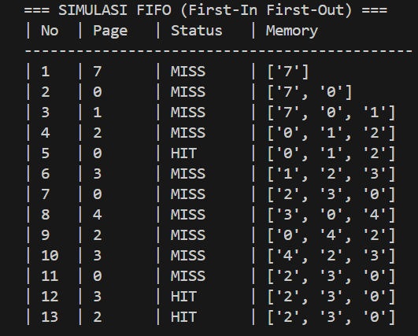
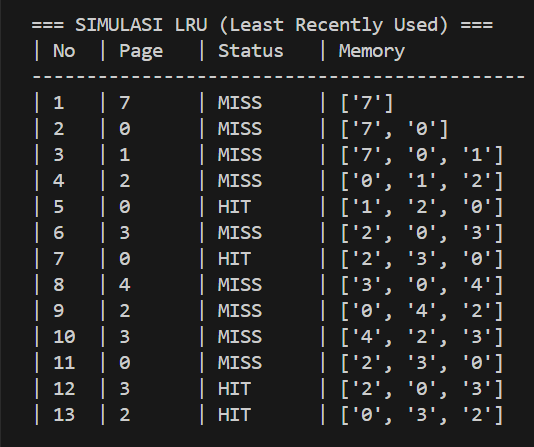
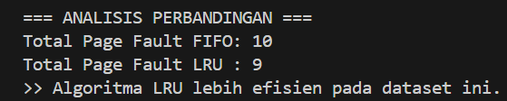

# Laporan Praktikum Minggu [10]
Topik: Manajemen Memori – Page Replacement (FIFO & LRU)


---

## Identitas
- **Nama**  : Syafi'iyah Rahmadani 
- **NIM**   : 250202968  
- **Kelas** : 1IKRB

---

## Tujuan
Setelah menyelesaikan praktikum ini, mahasiswa diharapkan mampu:

1. Mengimplementasikan algoritma page replacement FIFO dan LRU ke dalam program Python.
2. Menjalankan simulasi manajemen memori menggunakan dataset reference string yang ditentukan.
3. Membandingkan efisiensi antara algoritma FIFO dan LRU berdasarkan jumlah page fault yang dihasilkan.
4. Menyajikan analisis hasil simulasi secara sistematis dalam bentuk laporan.

---

## Dasar Teori
1. Manajemen Memori Virtual adalah teknik manajemen memori yang memungkinkan komputer untuk menjalankan aplikasi besar bahkan ketika kapasitas RAM (memori fisik) terbatas. Ketika data yang dibutuhkan tidak ada di RAM, sistem akan mengambilnya dari penyimpanan sekunder (disk), sebuah proses yang disebut page fault.

2. Algoritma Penggantian Halaman, algoritma ini digunakan oleh sistem operasi untuk memutuskan "halaman" mana yang harus dikeluarkan dari memori ketika semua frame penuh dan ada halaman baru yang perlu dimasukkan.

3. Algoritma FIFO (First-In First-Out) yaitu algoritma paling sederhana. Konsepnya adalah halaman pertama yang masuk ke memori akan menjadi halaman pertama yang dihapus atau engga diganti ketika terjadi page fault.

4. Algoritma LRU (Least Recently Used) algoritma ini mengganti halaman yang paling lama tidak digunakan atau belum diakses oleh CPU dalam periode terakhir. LRU dianggap lebih efisien daripada FIFO karena didasarkan pada perilaku penggunaan memori di dunia nyata.

---

## Langkah Praktikum
1. **Menyiapkan Dataset**

   Mennggunakan *reference string* berikut sebagai contoh:
   ```
   7, 0, 1, 2, 0, 3, 0, 4, 2, 3, 0, 3, 2
   ```
   Jumlah frame memori: **3 frame**.

2. **Implementasi FIFO**

   - Simulasikan penggantian halaman menggunakan algoritma FIFO.
   - Catat setiap *page hit* dan *page fault*.
   - Hitung total *page fault*.

3. **Implementasi LRU**

   - Simulasikan penggantian halaman menggunakan algoritma LRU.
   - Catat setiap *page hit* dan *page fault*.
   - Hitung total *page fault*.

4. **Eksekusi & Validasi**

   - Menjalankan program untuk FIFO dan LRU.
   - Memastikan hasil simulasi logis dan konsisten.
   - Menyimpan screenshot hasil eksekusi.

5. **Analisis Perbandingan**

   Membuat tabel perbandingan seperti berikut:

   | Algoritma | Jumlah Page Fault | Keterangan |
   |:--|:--:|:--|
   | FIFO | ... | ... |
   | LRU | ... | ... |


   - Menjelaskan mengapa jumlah *page fault* bisa berbeda.
   - Menganalisis algoritma mana yang lebih efisien dan alasannya.

6. **Commit & Push**

   ```bash
   git add .
   git commit -m "Minggu 10 - Page Replacement FIFO & LRU"
   git push origin main
   ```

---

## Kode / Perintah
Perintah utama
 1.  File *reference_string.txt*
```bash
   7, 0, 1, 2, 0, 3, 0, 4, 2, 3, 0, 3, 2
```
 2.  File *page_replacement.py*
```bash
import os

def load_data():
    script_dir = os.path.dirname(os.path.abspath(__file__))
    file_path = os.path.join(script_dir, 'reference_string.txt')
    with open(file_path, 'r') as f:
        # Mengonversi teks menjadi list angka
        return f.read().replace(',', ' ').split()

def simulate_fifo(pages, capacity):
    memory = []
    faults = 0
    print("\n=== SIMULASI FIFO (First-In First-Out) ===")
    print(f"{'| No':<5} | {'Page':<6} | {'Status':<8} | {'Memory':<15}")
    print("-" * 45)
    for i, page in enumerate(pages, 1):
        status = "HIT"
        if page not in memory:
            if len(memory) < capacity:
                memory.append(page)
            else:
                memory.pop(0) # Menghapus elemen pertama masuk
                memory.append(page)
            faults += 1
            status = "MISS"
        print(f"| {i:<3} | {page:<6} | {status:<8} | {str(memory):<15}")
    return faults

def simulate_lru(pages, capacity):
    memory = []
    faults = 0
    print("\n=== SIMULASI LRU (Least Recently Used) ===")
    print(f"{'| No':<5} | {'Page':<6} | {'Status':<8} | {'Memory':<15}")
    print("-" * 45)
    for i, page in enumerate(pages, 1):
        status = "HIT"
        if page not in memory:
            if len(memory) < capacity:
                memory.append(page)
            else:
                memory.pop(0)
                memory.append(page)
            faults += 1
            status = "MISS"
        else:
            # Logika LRU: Memindahkan page yang baru diakses ke paling belakang
            memory.remove(page)
            memory.append(page)
        print(f"| {i:<3} | {page:<6} | {status:<8} | {str(memory):<15}")
    return faults

if __name__ == "__main__":
    data = load_data()
    f_faults = simulate_fifo(data, 3)
    l_faults = simulate_lru(data, 3)
    
    print("\n=== ANALISIS PERBANDINGAN ===")
    print(f"Total Page Fault FIFO: {f_faults}")
    print(f"Total Page Fault LRU : {l_faults}")
    if l_faults < f_faults:
        print(">> Algoritma LRU lebih efisien pada dataset ini.")
   ```
3.  Commit & Push

   ```bash
   git add .
   git commit -m "Minggu 10 - Page Replacement FIFO & LRU"
   git push origin main
   ```

---

## Hasil Eksekusi
Sertakan screenshot hasil percobaan atau diagram:




---

## Analisis
1.  Tabel Perbandingan.

| Algoritma | Jumlah Page Fault | Keterangan |
   |:--|:--:|:--|
   | FIFO | 10 | Menganti halaman berdasarkan  urutan waktu masuk terlama. |
   | LRU | 9 | Menganti halaman berdasarkan  riwayat waktu akses terakhir. |  

2.  Analisis Jumlah Fault Bisa Berbeda.

    Jumlah page fault bisa berbeda karena ada perbedaan jumlah page fault terjadi karena kriteria pemilihan halaman yang akan diganti berbeda antara kedua algoritma sebagai berikut:

    - FIFO (First-In First-Out) bersifat kaku karena hanya mempertimbangkan urutan kronologis halaman yang dimasukkan ke dalam memori. Algoritma ini tidak mempertimbangkan apakah suatu halaman masih digunakan, sehingga sering kali mengeluarkan halaman yang sebenarnya masih dibutuhkan oleh CPU.

    - LRU (Least Recently Used) lebih dinamis karena menggunakan prinsip lokalitas temporal. Ia melacak waktu terakhir suatu halaman diakses. Jika terjadi kesalahan, ia mempertahankan halaman yang baru saja digunakan dan membuang halaman yang sudah lama tidak digunakan.

3. Analisa Algoritma Mana yang Lebih Efesien.

Algoritma LRU lebih efesien dibandingkan FIFO. Hal ini dibuktikan dengan jumlah page fault yang lebih rendah (9 fault). LRU lebih cerdas dalam menangani data yang dipanggil berulang kali (seperti angka 0, 2, dan 3 dalam dataset ini) dengan memperbarui posisinya di memori setiap kali terjadi page hit, sehingga mengurangi kemungkinan data dikeluarkan sebelum waktunya.

---

## Kesimpulan
Berdasarkan hasil praktikum manajemen memori ini, kita dapat menyimpulkan bahwa:

1. Mekanisme penggantian halaman sangat penting dalam memori virtual untuk mengatasi keterbatasan kapasitas RAM fisik.

2. Algoritma FIFO mudah diimplementasikan tetapi memiliki kelemahan kinerja karena tidak mempertimbangkan pola akses data CPU.

3. Algoritma LRU umumnya memberikan kinerja optimal karena beradaptasi dengan kebutuhan data yang aktif digunakan, meskipun membutuhkan manajemen tumpukan/penghitung yang lebih kompleks.

4. Memilih algoritma penggantian halaman yang tepat secara langsung memengaruhi efisiensi sistem dengan meminimalkan overhead akibat kesalahan halaman.

---

## Quiz
1. Apa perbedaan utama FIFO dan LRU?  
   **Jawaban:**  Perbedaan terletak pada kriteria pemilihan halaman yang digantikan jika memori prnuh
   Penjelasan perbedaannya
   - FIFO (First-In First-Out): Mengganti halaman berdasarkan waktu masuk; halaman yang paling lama berada di memori akan dikeluarkan terlebih dahulu, terlepas dari frekuensi aksesnya.

    - LRU (Least Recently Used): Mengganti halaman berdasarkan riwayat akses; halaman yang paling lama tidak digunakan akan dikeluarkan karena dianggap tidak mungkin diakses lagi dalam waktu dekat.
2. Mengapa FIFO dapat menghasilkan Belady’s Anomaly?  
   **Jawaban:**  Anomali Belady adalah kondisi aneh di mana peningkatan jumlah frame memori justru menyebabkan peningkatan jumlah page fault. FIFO dapat mengalami hal ini di karena sebagai berikut.
   
   1. Algoritma ini bukan Algoritma Stack. FIFO tidak menjamin bahwa himpunan halaman dalam memori dengan $n$ frame selalu menjadi bagian dari himpunan halaman dalam memori dengan $n+1$ frame.
   
   2. Karena hanya bergantung pada urutan entri, FIFO dapat membuang halaman yang sangat sering dibutuhkan hanya karena halaman tersebut telah berada di memori untuk waktu yang lama, sehingga ketika halaman tersebut dibutuhkan lagi, terjadi page fault tambahan.
3. Mengapa LRU umumnya menghasilkan performa lebih baik dibanding FIFO?  
   **Jawaban:**
   - Prinsip Lokalitas: LRU memanfaatkan prinsip Lokalitas Referensi dengan menyimpan halaman yang aktif diakses di memori.

    - Efisiensi Memori: Hanya halaman "dingin" (halaman yang sudah lama tidak digunakan) yang dikeluarkan, sehingga menghasilkan pemanfaatan memori yang optimal.

    - Adaptif: Tidak seperti FIFO yang kaku pada saat masuk, LRU beradaptasi dengan pola program; halaman yang sering diakses terus diperbarui untuk mencegah pengeluaran, sehingga meminimalkan kesalahan halaman.

---

## Refleksi Diri
Tuliskan secara singkat:
- Apa bagian yang paling menantang minggu ini?  
Bagian paling menantang adalah mengimplementasikan logika algoritma FIFO dalam kode pemrograman dan memaastikan tampilan output terminal berupa tabel yang rapih serta sejajar agar data mudah dianalisis.
- Bagaimana cara Anda mengatasinya? 
 Saya mengatasi hal ini dengan menggunakan fungsi pop(0) dan append() untuk logika FIFO yang akurat, serta teknik penyelarasan f-string untuk merapikan tabel. Validasi hit/miss juga diimplementasikan untuk memastikan penghitungan page fault yang akurat dan kemudahan analisis.

---

**Credit:**  
_Template laporan praktikum Sistem Operasi (SO-202501) – Universitas Putra Bangsa_
