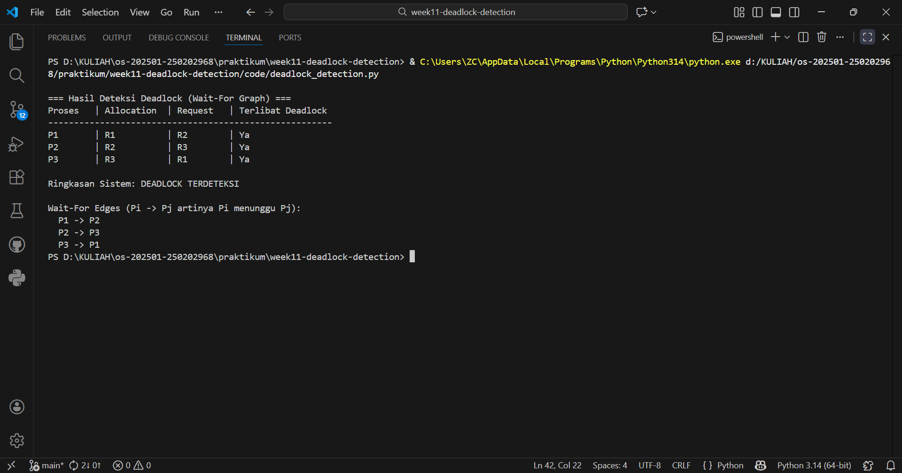

# Laporan Praktikum Minggu [11]
Topik: Simulasi dan Deteksi Deadlock


---

## Identitas
- **Nama**  : Syafi`iyah Rahmadani  
- **NIM**   : 25022968  
- **Kelas** : 1IKRB

---

## Tujuan
1. Membuat program deteksi deadlock sederhana berbasis Python.
2. Menjalankan simulasi menggunakan dataset uji CSV.
3. Menyajikan analisis hasil dalam bentuk tabel sistematis.
4. Memberikan interpretasi logis berdasarkan teori deadlock.

---

## Dasar Teori
Dasar Teoretis untuk Deteksi Deadlock
- Deadlock didefinisikan sebagai kondisi dalam sistem operasi di mana sekelompok proses ditangguhkan secara permanen karena setiap proses menunggu sumber daya yang dipegang oleh proses lain dalam kelompok tersebut.

- Deadlock memiliki empat kondisi utama; deadlock hanya dapat terjadi jika keempat kondisi tersebut terpenuhi secara bersamaan: Mutual Exclusion, Hold and Wait, No Preemption, dan Circular Wait.

- Metode deteksi berbeda dari metode pencegahan; metode deteksi memungkinkan sistem untuk berjalan apa adanya dan secara berkala menjalankan algoritma untuk memeriksa proses yang saling mengunci.

- Wait-For Graph, model grafik yang digunakan untuk mendeteksi deadlock dalam sistem dengan satu sumber daya; jika grafik berisi loop, deadlock pasti terjadi.

- Pendekatan deteksi ini penting karena memberikan fleksibilitas yang lebih besar dan pemanfaatan sumber daya yang lebih efisien daripada metode pencegahan, yang cenderung terlalu membatasi sistem.

---

## Langkah Praktikum
1. **Menyiapkan Dataset**

   Gunakan dataset sederhana yang berisi:
   - Daftar proses  
   - Resource Allocation  
   - Resource Request / Need

   Contoh tabel:

   | Proses | Allocation | Request |
   |:--:|:--:|:--:|
   | P1 | R1 | R2 |
   | P2 | R2 | R3 |
   | P3 | R3 | R1 |

2. **Mengimplementasi Algoritma Deteksi Deadlock**

   Program minimal harus:
   - Membaca data proses dan resource.  
   - Menentukan apakah sistem berada dalam kondisi deadlock.  
   - Menampilkan proses mana saja yang terlibat deadlock.

3. **Eksekusi & Validasi**

   - Menjalankan program dengan dataset uji.  
   - Validasikan hasil deteksi dengan analisis manual/logis.  
   - Menyimpan hasil eksekusi dalam bentuk screenshot.

4. **Analisis Hasil**

   - Menyajikan hasil deteksi dalam tabel (proses deadlock / tidak).  
   - Menjelaskan mengapa deadlock terjadi atau tidak terjadi.  
   - mengaitkan hasil dengan teori deadlock (empat kondisi).

5. **Commit & Push**

   ```bash
   git add .
   git commit -m "Minggu 11 - Deadlock Detection"
   git push origin main
   ```

---

## Kode / Perintah

```powershell
& C:\Users\ZC\AppData\Local\Programs\Python\Python314\python.exe code/deadlock_detection.py
```

```bash
git add .
git commit -m "Minggu 11 - Deadlock Detection"
git push origin main
```


---

## Hasil Eksekusi
Sertakan screenshot hasil percobaan atau diagram:


---

## Analisis
Makna Hasil Eksperimen Berdasarkan simulasi yang dijalankan, program berhasil mengidentifikasi bahwa sistem berada dalam kondisi Deadlock. Output program menunjukkan bahwa proses P1, P2, dan P3 tidak dapat melanjutkan eksekusi karena terjebak dalam penantian sumber daya yang saling terkait. Melalui penelusuran Wait-For Graph, rantai ketergantungan P1 -> P2 -> P3 -> P1 terdeteksi, yang berarti bahwa setiap entitas dalam sistem menunggu entitas lain secara melingkar.

Hubungan antara Hasil dan Teori: Hasil eksperimen ini menunjukkan pemenuhan simultan dari empat kondisi terjadinya deadlock.

   - Mutual exclusion: sumber daya R1, R2, dan R3 hanya dapat digunakan oleh satu proses pada satu waktu.

   - Hold and Wait: Tabel ini menunjukkan proses yang memegang sumber daya (Alokasi) sambil meminta sumber daya baru (Permintaan).

   - No preemption: sumber daya tidak dapat diambil kembali secara paksa, sehingga proses terus menunggu tanpa batas waktu.

   - Circular wait: Kondisi ini dideteksi melalui jalur melingkar dalam grafik hubungan proses yang dikelola oleh program.

Implementasi algoritma ini menunjukkan bahwa metode Deteksi Deadlock efektif dalam memberikan visibilitas terhadap kegagalan sistem tanpa membatasi kinerja proses pada awalnya. Dengan menyajikan data dalam bentuk tabel dan jalur hubungan, administrator sistem dapat memberikan interpretasi logis untuk menentukan proses mana yang harus dihentikan untuk pemulihan.

---

## Kesimpulan
Kesimpulan dari hasil laporan kali ini sebagai brikut:
- Pencapaian tujuan praktikum telah berhasil memenuhi seluruh tujuan instruksional, mulai dari pembuatan program deteksi, simulasi dengan dataset, hingga penyajian analisis sistematis.
- Efektivitas algoritma menghasilkan program berbasis Python yang diimplementasikan terbukti efektif dalam mendeteksi kondisi *unsafe state* dengan menggunakan logika *Wait-For Graph*.
- Validasi teori hasil simulasi memberikan bukti nyata terjadinya deadlock akibat terpenuhinya empat syarat utama, khususnya kondisi *Circular Wait* yang divisualisasikan melalui rantai ketergantungan P1 -> P2 -> P3 -> P1.
- Relevansi Metode pendekatan *Deadlock Detection* terbukti memberikan fleksibilitas lebih tinggi dalam utilisasi sumber daya dibandingkan metode pencegahan, meskipun memerlukan pemantauan berkala (*overhead*).
- Kepatuhan teknis, seluruh hasil pengerjaan telah disusun dan didokumentasikan sesuai dengan standar struktur folder dan ketentuan teknis yang telah ditetapkan dalam modul praktikum.

---

## Quiz
1. Apa perbedaan antara deadlock prevention, avoidance, dan detection? 
   **Jawaban:**
Perbedaan antara deadlock prevention, avoidance, dan detection sebagai berikut:
   - Pencegahan: Metode ini bekerja dengan memastikan bahwa setidaknya satu dari empat kondisi utama untuk terjadinya deadlock (seperti Circular Wait) tidak pernah terpenuhi sejak awal.

   - Penghindaran: Metode ini secara dinamis memeriksa setiap permintaan sumber daya untuk memastikan sistem tetap berada dalam "Keadaan Aman" (misalnya, Algoritma Banker).

   - Deteksi: Metode ini membiarkan sistem berjalan apa adanya tanpa batasan ketat, kemudian secara berkala menggunakan algoritma untuk memeriksa adanya siklus deadlock.
2. Mengapa deteksi deadlock tetap diperlukan dalam sistem operasi? 
   **Jawaban:**  
   Karena deteksi deadlock diperlukan karena memberikan efisiensi sumber daya dan fleksibilitas yang lebih tinggi dibandingkan metode pencegahan atau penghindaran yang cenderung restriktif. Dengan membiarkan proses berjalan tanpa pengecekan keamanan yang kaku di setiap langkah, sistem dapat beroperasi dengan kapasitas maksimal dan tetap lancar saat menghadapi beban kerja tidak terduga tanpa mengorbankan performa keseluruhan.
3. Apa kelebihan dan kekurangan pendekatan deteksi deadlock?  
   **Jawaban:**  
   - Keuntungannya adalah memberikan kebebasan lebih besar pada proses untuk meminta sumber daya tanpa aturan kaku di awal, sehingga meningkatkan produktivitas sistem secara keseluruhan.

   - Kerugiannya adalah menimbulkan beban CPU tambahan untuk menjalankan algoritma deteksi secara teratur, dan ada risiko kehilangan data atau kemajuan proses selama pemulihan setelah kebuntuan terdeteksi.

---

## Refleksi Diri
Tuliskan secara singkat:
- Apa bagian yang paling menantang minggu ini?  
- Bagaimana cara Anda mengatasinya?  

---

**Credit:**  
_Template laporan praktikum Sistem Operasi (SO-202501) – Universitas Putra Bangsa_
