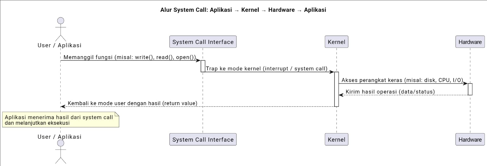
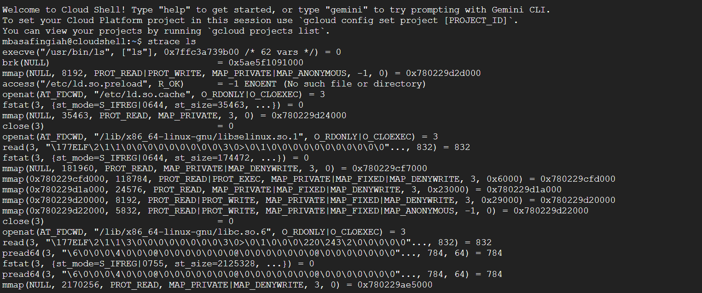
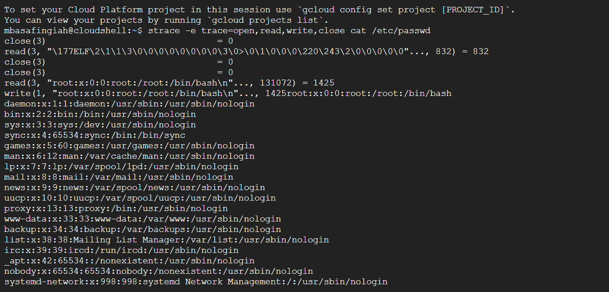
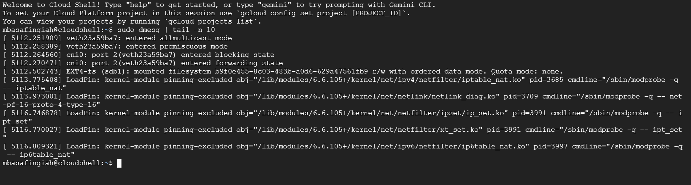

# Laporan Praktikum Minggu [X]
Topik: Struktur System Call dan Fungsi Kernel

---

## Identitas
- **Nama**  : Sayafi'iyah Rahmadani
- **NIM**   : 250202968 
- **Kelas** : 1IKRB

---

## Tujuan

1. Mahasiswa mampu menjelaskan konsep dan fungsi system call dalam sistem operasi.
2. Mahasiswa mampu mengidentifikasi jenis-jenis system call dan fungsinya.
3. Mahasiswa bisa mengamati alur perpindahan mode user ke kernel saat system call terjadi.
4. Mahasiswa mampu menggunakan perintah Linux untuk menampilkan dan menganalisis system call.


---

## Dasar Teori

Syistem call adalah cara penting di sistem oprasi yang membiarkan program aplikasi di bagian pengguna meminta bantuan dari karnel, seperti mengakses perangkat keras, membaca file atau mengatur memori, dan melalui cara yang aman agar tidak menyentuh bagian penting sistem secara langsung. Caranya sederhana yaitu program memmagil fungsi tersebut, sistem berpindah ke mode karnel lewat printah khusus, karnel melakukan pekerjaan dengan mengecek izin dan mengatur sumber daya  seperti CPU, memori, dan I/O, lalu mengembalikan hasil ke program. Tugas utama karnel adlah memastikan keamanan, kestabilan,dan bisa menangani banyak tugas sekaligus, sehingga aplikasi jadi lebih mudah dipindah-pindah dan aman dari kesalahan, mweskipun ada keterlambatan dalam bekerja.
---

## Langkah Praktikum
Langkah-langkah yang dilakukan pada praktikum minggu kedua ini adalah sebagai berikut:
1. Mempelajari dan memahami materi minggu kedua, tentang struktur system call dan fungsi karnel.
2. Lalu menyiapkan Linux (Ubuntu/WSL) yang telah siap digunakan.
3. Menginstal strace dan man
4. Melakukan Eksperimen 1 Analisis System Call "strace ls"
5. Eksperimen 2 Menelusuri System Call File I/O "trace -e trace=open,read,write,close cat /etc/passwd"
6. Eksperimen 3 Mode User vs Kernel "dmesg | tail -n 10"
7. Lalu melakukan screenshot hasil linux
8. Lalu di masukan ke dalam laporan.md
9. Commit & Push untuk hasil screenshot dan laporannya.

---

## Kode / Perintah
Tuliskan potongan kode atau perintah utama:
```bash
`strace ls`

`strace -e trace=open,read,write,close cat /etc/passwd`

`dmesg | tail -n 10`
```

---

## Hasil Eksekusi
Sertakan screenshot hasil percobaan atau diagram:


## Hasil Eksperimen 1


Tabel Observasi `strace ls`
| System call | Keterangan |
|:---| :--- |
| execve("/usr/bin/ls", ["ls"], [/* env */]) | Kernel memuat program ls untuk dijalankan.
|brk(NULL) | Menyiapkan area memori program.
| `mmap(NULL, 8192, PROT_READ | Memetakan memori baru untuk program.
| access("/etc/ld.so.preload", R_OK) | File tidak ada (biasa pada sistem umum)
| `openat(AT_FDCWD, "/etc/ld.so.cache", O_RDONLY | = 3
| `fstat(3, {st_mode=S_IFREG | = 0
|mmap(NULL, 35463, PROT_READ, MAP_PRIVATE, 3, 0)| Agar bisa dibaca langsung dari memori.
| `openat(AT_FDCWD, "/lib/x86_64-linux-gnu/libselinux.so.1", O_RDONLY | = 3
|read(3, "\177ELF\2\1\1\3\0..." , 832) | ELF adalah format file biner di Linux.
| mmap(NULL, 181960, PROT_READ, MAP_PRIVATE, 3, 0) | Digunakan agar fungsi library bisa diakses ls |

## Hasil Eksperimen 2


Tabel Observasi `strace -e trace=open,read,write,close cat /etc/passwd`

| System call | Keterangan |
|:---| :--- |
| open("/etc/passwd", O_RDONLY) | File descriptor 3 berhasil dibuat.|
| read(3, "\177ELF\2\1\1\3\0..." , 832) | Kernel membaca 832 byte data dari file. |
| close(3) | File sementara ditutup setelah pembacaan awal selesai. |
| read(3, "root:x:0:0:root:/root:/bin/bash\n...", 131072) | Membaca seluruh isi file user akun sistem. |
| write(1, "root:x:0:0:root:/root:/bin/bash\n...", 1425) | Menampilkan isi file /etc/passwd ke terminal. |
| close(3) | File descriptor dilepaskan dari memori kernel. |

## Hasil Eksperimen 3


Tabel Observasi `dmesg | tail -n 10`

| System call | Keterangan |
|:---| :--- |
|dmesg | Menampilkan pesan log kernel (device, modul, driver, dll). |
| modprobe | Memuat modul kernel secara dinamis.|

---

## Analisis
1.	Pentingnya system call untuk keamanan OS
System call sangat penting bagi keamanan sistem operasi karena berfungsi menjadi mekanisme penghubung antara program pengguna (user space)  dan kernel space (kernel space). Kernel merupakan inti dari sistem operasi yang memiliki akses penuh terhadap perangkat keras dan seluruh sumber daya sistem tanpa mekanisme system call, program pengguna bisa langsung mengakses hardware atau memori kernel yang berpotensi merusak sistem. Dan akses ke kernel tidak dilakukan secara langsung, melainkan melalui system call.

Dari sisi keamanan, system call memiliki peran yang sangat vital. Ia berperan sebagai pengendali akses (access control) yang memastikan hanya operasi yang diizinkan dan aman saja yang dapat dilakukan oleh aplikasi. Tanpa mekanisme ini, program pengguna dapat langsung memodifikasi memori kernel atau mengakses perangkat keras secara sembarangan, yang dapat menyebabkan crash sistem, kebocoran data, atau bahkan serangan berbahaya seperti privilege escalation. Dan ada keamanan utamanya yaitu meliputi:  
•	 Mencegah akses langsung ke kernel/hardware
Hanya kernel yang boleh mengelola sumber daya seperti CPU, memori, dan perangkat I/O. System call memastikan semua permintaan dari user program yang melewati pemeriksaan keamanan.
•	 Validasi dan pembatasan akses
Kernel memeriksa apakah proses memiliki hak izin sebelum mengizinkan operasi misalnya membuka file sistem atau mengubah konfigurasi jaringan.
•	 Menangani error dan mencegah crash
Jika ada kesalahan pada user program misalnya pointer tidak valid, kernel dapat menolak permintaan tanpa membuat sistem macet.
Dapat disimpulkan bahwa system call bertindak sebagai lapisan perlindungan antara aplikasi dan kernel agar sistem tetap stabil dan aman.

2. Cara OS memastikan transisi user–kernel berjalan dengan aman
Ketika program pengguna memanggil system call, terjadi perpindahan mode dari user mode → kernel mode. Proses ini dijaga ketat oleh sistem operasi agar tidak disalahgunakan.
Langkah-langkah keamanan dalam transisi:
1.	 Mode Proteksi CPU
CPU menyediakan dua mode eksekusi yaitu user mode (terbatas) dan kernel mode (penuh). Transisi ke kernel hanya bisa dilakukan lewat instruksi khusus, seperti int 0x80 atau syscall pada arsitektur x86_64.
2.	 Tabel System Call (System Call Table)
Kernel hanya mengizinkan pemanggilan fungsi yang terdaftar dalam tabel system call. Fungsi kernel lain tidak bisa diakses langsung.
3.	 Validasi Argumen
Kernel memeriksa semua parameter dari program pengguna misalnya alamat memori dan hak akses file, sebelum menjalankan operasi.
4.	 Kembali ke User Mode
Setelah eksekusi selesai, kernel mengembalikan hasil ke user mode dengan kontrol penuh, memastikan kernel tidak tetap terbuka untuk manipulasi.

 Contoh System Call Umum di Linux

Beberapa system call yang sering digunakan dalam sistem Linux antara lain:
| Nama System call | Keterangan |
|:---| :--- |
| open() | membuka file. |
| read() | membaca isi file. |
| write() | menulis data ke file. |
| close() | menutup file yang sudah dibuka. |
| fork() | membuat proses baru. |
| exec() | mengeksekusi program baru. |
| wait() | menunggu proses anak selesai. |
| exit() | keluar dari proses. |
| getpid() | mengambil ID proses yang sedang berjalan. |

System call adalah mekanisme penting yang menjamin keamanan dan stabilitas sistem operasi dengan:
•	Menjadi perantara aman antara aplikasi dan kernel.
•	Mengatur transisi user–kernel melalui mode proteksi CPU dan validasi argumen.
•	Menyediakan akses terkontrol ke sumber daya sistem melalui daftar fungsi resmi


---

## Kesimpulan
Dari pratikum ini dapat disimpulkan bahwa system call adalah penghubung antara program pengguna dan kernel yang memungkinkan aplikasi mengakses layanan sistem secara aman tanpa menyentuh langsung bagian inti OS. Mekanisme ini menjaga keamanan dan kestabilan sistem dengan mengatur perpindahan dari **user mode** ke **kernel mode** secara aman dan memastikan setiap permintaan program. Dari hasil percobaan menggunakan `strace` dan `dmesg`, terlihat bahwa setiap aktivitas seperti membuka, membaca, menulis, dan menutup file dikendalikan oleh kernel. Dengan demikian, **system call berperan penting dalam menjaga sistem operasi tetap aman, stabil, dan efisien.**


---

## Quiz
1. Apa fungsi utama system call dalam sistem operasi?  
   **Jawaban:**
    Fungsi utama system call adalah menyediakan layanan dasar OS kepada aplikasi pengguna dengan cara yang terkontrol, yaitu mencakup :
- Manajemen proses untuk membuat, menghentikan, atau mengelola proses misalnya,` fork()` untuk membuat proses baru di Unix-like OS.
- Manajemen memori yang mengalokasikan atau membebaskan memori misalnya, `malloc()`atau `free()` di level sistem.
- Input/Output (I/O) untuk  membaca atau menulis data ke file, perangkat, atau jaringan misalnya, `read()` dan `write()` di POSIX.

2. Sebutkan 4 kategori system call yang umum digunakan. 
   **Jawaban:**
•	Process Control: Mengelola pembuatan, eksekusi, dan penghentian proses.

•	File Management: Menangani operasi pada file dan direktori, seperti membaca, menulis, atau menghapus. 

•	Device Management: Mengontrol perangkat input/output (I/O), seperti keyboard, layar, atau printer.
s
•	Communication: Memfasilitasi komunikasi antar proses atau sistem, termasuk berbagi data.

3. Mengapa system call tidak bisa dipanggil langsung oleh user program?  
   **Jawaban:** 
    System call tidak dapat dipanggil langsung oleh aplikasi pengguna karena adanya pemisahan mode eksekusi demi menjaga keamanan dan kestabilan sistem. Program dijalankan dalam mode pengguna (user mode) yang memiliki hak akses terbatas dan tidak dapat berinteraksi langsung dengan perangkat keras, sedangkan system call membutuhkan mode kernel. Proses perpindahan akan dilakukan melalui mekanisme interupsi atau instruksi syscall yang memungkinkan transisi aman menuju kernel, di mana permintaan akan diverifikasi dan dijalankan. Hal ini bisa mencegah kerusakan atau penyalahgunaan oleh aplikasi yang berpotensi berbahaya serta memastikan pengendalian hak akses tetap terjaga.

---

## Refleksi Diri
Tuliskan secara singkat:
- Apa bagian yang paling menantang minggu ini?  
- Bagaimana cara Anda mengatasinya?  

---

**Credit:**  
_Template laporan praktikum Sistem Operasi (SO-202501) – Universitas Putra Bangsa_
