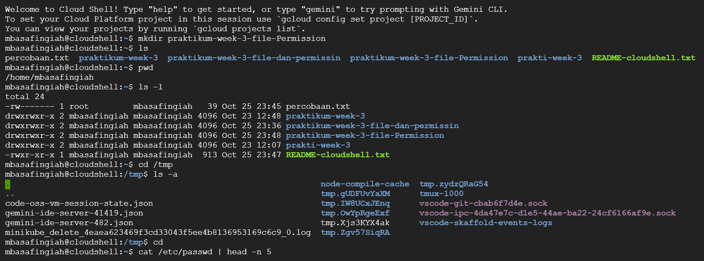
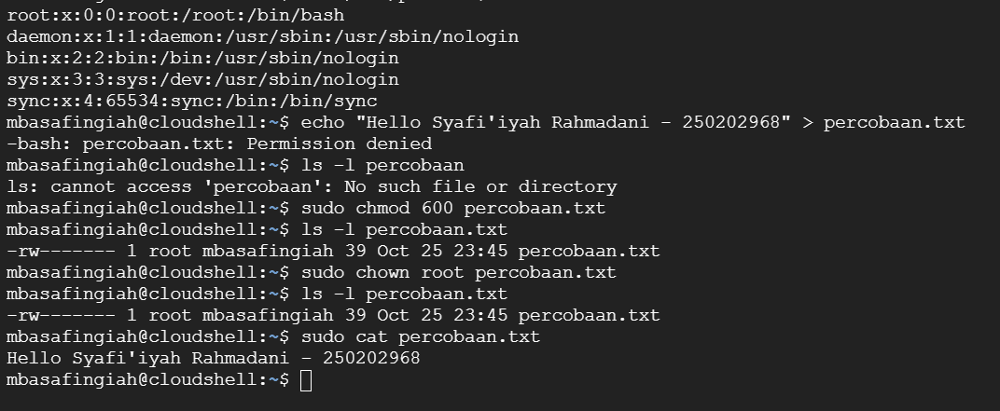

# Laporan Praktikum Minggu [3]
Topik: Manajemen File dan Permission di Linux

---

## Identitas
- **Nama**  : Syafi'iyah Rahmadani 
- **NIM**   : 250202968  
- **Kelas** : 1IKRB

---

## Tujuan

Tujuan dari praktikum ini adalah agar mahasiswa mampu mengoperasikan perintah dasar Linux seperti `ls`, `pwd`, `cd`, dan `cat` untuk melakukan navigasi file serta direktori dengan benar. Selain itu, mahasiswa diharapkan dapat menggunakan `chmod` dan `chown` dalam mengatur hak akses serta kepemilikan file. Mahasiswa juga dituntut untuk menganalisis dan menjelaskan hasil output dari perintah-perintah Linux dasar yang digunakan. Mahasiswa juga diharapkan mampu menyusun laporan praktikum dengan struktur yang sesuai serta mengunggah dokumentasi hasil praktikum ke repositori Git secara tepat waktu sebagai bentuk tanggung jawab dan kerapian dalam pengelolaan hasil kerja.

---

---

## Dasar Teori
Teori Manajemen File dan Permission di Linux
1.	Sistem Berkas (File System) Linux
Dalam sistem Linux yaitu menggunakan struktur hierarki dari direktori yang dimulai dari root (/). Semua file dan direktori dapat diakses melalui jalur absolut maupun relatif. Arahan yang dilakukan dengan perintah seperti ls, cd, dan pwd untuk mengetahui posisi atau direktori aktif yang digunakan.
2.	Hak Akses (File Permission)
Di setiap file di Linux memiliki tiga jenis hak akses yaitu read (r)untuk membaca, write (w)untuk menulis atau mengubah isi, dan execute (x)untuk menjalankan file. Hak akses tersebut dibagi menjadi tiga kategori pengguna yaitu owner (pemilik), group (grup), dan others (pengguna lain). Pengaturan hak akses tersebut ini menggunakan printah `chmod`.
3.	Kepemilikan File (Ownership)
Setiap file atau folder di Linux memiliki dua atribut utama, yaitu siapa pemiliknya (user owner) dan kepemipemilikan tertinggi (group owner). Kepemilikan ini bisa diubah dengan perintah `chown` (change owner) untuk mengatur siapa yang memiliki kontrol terhadap file tersebut.
4.	Struktur File Sistem dan Informasi Pengguna
File seperti `/etc/passwd` berisi tentang informasi penting yaitu tentang akun pengguna sistem, termasuk nama pengguna, UID, GID, folder utama, dan shell yang digunakan. Perintah `cat` atau `head` digunakan untuk membaca sebagian isi file tersebut.
5.	Keamanan dan Manajemen Akses Sistem
Pengaturan permission dan ownership merupakan bagian penting dari keamanan sistem Linux. Dengan membatasi akses baca, tulis, dan eksekusi, administrator dapat mencegah pengguna (user) yang tidak berwenang melakukan perubahan terhadap file sistem.

---

## Langkah Praktikum
Langkah-langkah yang dilakukan pada praktikum minggu kedua ini adalah sebagai berikut:
1.	Mempelajari dan memahami materi minggu ketiga, tentang, menejemen file dan permission di linux.
2.	Lalu menyiapkan Linux (Ubuntu/WSL) yang telah siap digunakan.
3.	Memverivikasi bahwa folder kerja berada di dalam repositori Git praktikum.
4.	Melakukan Eksperimen 1 Navigasi Sistem File.
5.	Eksperimen 2 Menelusuri  Membaca File.
6.	Eksperimen 3  Permission & Ownership.
7.	Lalu melakukan screenshot hasil linux lalu disimpan di `praktikum/week3-linux-fs-permission/screenshots/`
8.	Lalu di masukan ke dalam laporan.md
9.	Commit & Push untuk hasil screenshot dan laporannya.


---

## Kode / Perintah
Tuliskan potongan kode atau perintah utama:
```bash
pwd
ls -l
cd /tmp
ls -a

cat /etc/passwd | head -n 5

echo "Hello <NAME><NIM>" > percobaan.txt
ls -l percobaan.txt
chmod 600 percobaan.txt
ls -l percobaan.txt

sudo chown root percobaan.txt
ls -l percobaan.txt

---

## Hasil Eksekusi
Sertakan screenshot hasil percobaan atau diagram:



 Pada percobaan ini menggunakan beberapa perintah Linux untuk mengelola file dan izin aksesnya.
Perintah `mkdir` berfungsi untuk membuat direktori baru, dan hasilnya bisa terlihat bahwa folder praktikum berhasil terbentuk.
Selanjutnya, perintah `ls -l` digunakan untuk menampilkan informasi detail dari file dan direktori, seperti permission, pemilik, dan grup yang tertera di sistem.
Perintah `pwd` digunakan untuk mengetahui lokasi direktori aktif yang sedang digunakan, yaitu berada di `/home/mbasafingiah`.
Kemudian, dengan perintah `cat /etc/passwd`, sistem menampilkan data pengguna (user) yang terdaftar pada sistem, dan hanya lima baris pertama yang ditampilkan karena disertai opsi `head -n 5`.
Dan saat mencoba menulis teks ke file menggunakan perintah `echo`, proses gagal karena pengguna tidak memiliki izin tulis pada file tersebut.
Untuk memperbaikinya, digunakan perintah `chmod 600` yang berfungsi untuk mengatur izin file agar hanya pemilik (root) yang dapat mengaksesnya.
Setelah itu, perintah `chown root` dijalankan untuk mengubah kepemilikan file menjadi milik root.
Pada akhirnya isi file berhasil ditampilkan dengan menggunakan perintah `cat` yang dijalankan melalui hak akses superuser (`sudo`), sehingga isi teks di dalam file dapat dibaca dengan sukses.
   


---

## Analisis
Dari hasil percobaan yang telah dilakukan, dapat dilihat bahwa sistem Linux memiliki pengaturan keamanan yang ketat melalui permission (izin akses) dan ownership (kepemilikan).
File `percobaan.txt` awalnya hanya bisa diakses oleh pengguna saja dan dengan izin tertentu, dan ketika hak akses diubah menggunakan` chmod`, sistem langsung menyesuaikan izin baca dan tulisnya.
Lalu perintah `chown` juga berfungsi penting untuk menentukan siapa pemilik dari file tersebut.
Kesalahan permission denied ini menunjukkan bahwa Linux selalu membatasi tindakan pengguna yang tidak memiliki hak akses agar file sistem tetap aman.
Dengan menggunakan `sudo`, pengguna bisa mendapatkan hak sementara sebagai root untuk menjalankan perintah yang memerlukan izin khusus.
Hal ini membuktikan bahwa konsep keamanan dan kontrol akses di Linux bekerja dengan baik dan terstruktur.
Keunikan utama praktikum di Linux terletak pada terminal dengan perintah teks dan pengaturan hak akses file yang ketat.
Linux ini memberikan pengalaman langsung tentang konsep keamanan, kontrol akses, dan struktur sistem operasi, yang tidak sejelas pada platfrom lain seperti Windows.

---

## Kesimpulan
Dari percobaan ini dapat disimpulkan bahwa sistem Linux memiliki mekanisme keamanan yang berbasis permission dan ownership.
Setiap file memiliki hak akses yang membedakan antara pemilik (owner), grup, dan pengguna lain (others).
Untuk file yang dimiliki oleh` root`, pengguna biasa tidak dapat mengubah atau membaca isinya tanpa izin superuser (`sudo`).
Dengan memahami perintah seperti `chmod`, `chown`, dan `ls -l`,`ls -a`, dan pengguna dapat mengatur keamanan file secara efektif.

---

## Quiz
1. Apa fungsi dari perintah chmod?
   **Jawaban:**  Perintah chmod (change mode) digunakan untuk mengubah hak akses terhadap file atau direktori pada sistem operasi berbasis UNIX/Linux. Melalui perintah ini, pengguna (user) dapat mengatur hak akses bagi pemilik, grup, maupun pengguna lain, sehingga dapat ditentukan siapa yang berhak membaca, mengubah, atau menjalankan file tersebut.

2. Apa arti dari kode permission rwxr-xr--?  
   **Jawaban:**  Arti kode rwxr-xr--  yaitu menjelaskan hak akses file sebagai berikut:
1.	`rwx` → pemilik (owner) dapat read, write, dan execute contoh nya baca, tulis, dan jalankan.
2.	`r-x` → grup dapat read dan execute, namun tidak bisa write.
3.	`r--` → pengguna lain ini hanya bisa read saja.
Dengan demikian, file tersebut bisa dijalankan dan diubah oleh pemilik, dijalankan oleh anggota grup, dan hanya dibaca oleh pengguna lain.

3. Jelaskan perbedaan antara chown dan chmod. 
   **Jawaban:**  a.	chown digunakan untuk mengubah kepemilikan (owner dan group) dari suatu file ataufolder.
Contoh: chown user1:group1 file.txt → mengubah pemilik menjadi user1 dan grup menjadi group1.
b.	chmod digunakan untuk mengubah hak akses terhadap file atau direktori, yaitu bukan pemiliknya.
Contoh: chmod 755 file.txt → mengatur hak akses baca/tulis/eksekusi sesuai kode tersebut.


---

## Refleksi Diri
Tuliskan secara singkat:
- Apa bagian yang paling menantang minggu ini? 
Yang paling menantang di minggu ini yaitu tentang percobaan exsperimen di Linux
- Bagaimana cara Anda mengatasinya?  
Cara saya mengatasinya yaitu bertanya pada teman dan dan berusaha memahami
---

_Template laporan praktikum Sistem Operasi (SO-202501) – Universitas Putra Bangsa_
