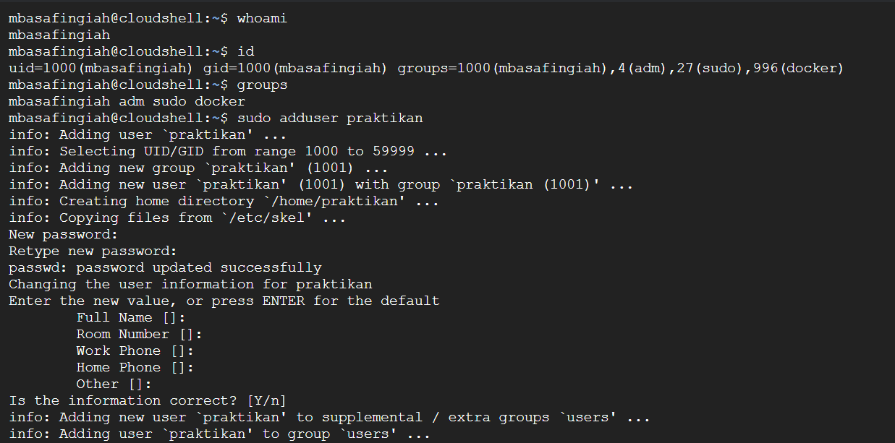
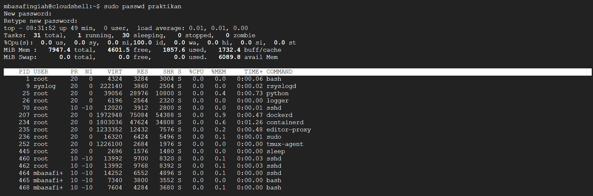
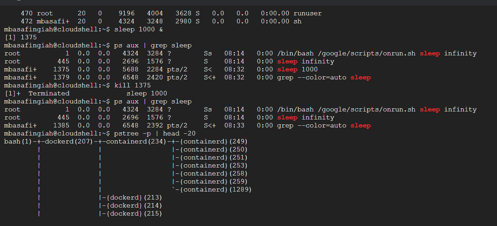
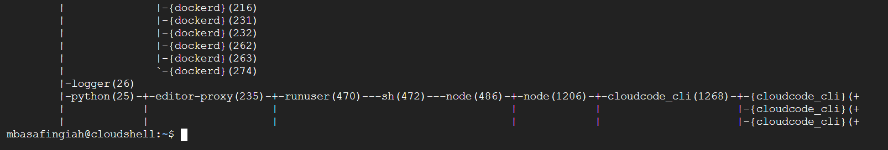

# Laporan Praktikum Minggu [4]
Topik: Manajemen Proses dan User di Linux

---

## Identitas
- **Nama**  : Syafi'iyah Rahmadani  
- **NIM**   : 250202968 
- **Kelas** : 1IKRB

---

## Tujuan
Tujuan dari praktikum ini adalah agar mahasiswa mampu menjelaskan konsep proses dan user dalam sistem operasi Linux, menampilkan daftar dan status proses yang sedang berjalan, menggunakan perintah untuk membuat dan mengelola user, menghentikan atau mengontrol proses tertentu menggunakan PID, serta menjelaskan kaitan antara manajemen user dan keamanan sistem.

---

## Dasar Teori
Eksperimen ini berfokus pada dua konsep inti dalam manajemen Sistem Operasi Linux: Manajemen User dan Manajemen Proses.
1.	Konsep User dan Group
 Linux adalah sistem multi-user. Setiap user diidentifikasi oleh UID (User ID) dan secara opsional tergabung dalam satu atau lebih Group, diidentifikasi oleh GID (Group ID). Manajemen user seperti membuat user baru dengan `adduser` atau mengubah kata sandi dengan `passwd` sangat penting untuk keamanan sistem, karena hak akses yaitu membaca, menulis, mengeksekusi ke file dan sumber daya ditentukan berdasarkan user dan group. Perintah seperti `whoami`, `id`, dan `groups` digunakan untuk memverifikasi identitas dan keanggotaan.
2.	Konsep Proses
 Sebuah proses adalah sebuah program yang sedang berjalan. Setiap proses memiliki PID (Process ID) yang unik, yang digunakan untuk mengidentifikasinya. Proses memiliki status misalnya, Running, Sleeping, Stopped, Zombie dan hierarki proses induk/anak.
3.	Manajemen Proses
Perintah seperti `ps aux` digunakan untuk menampilkan daftar semua proses yang sedang berjalan, termasuk detail seperti PID, user, penggunaan memori (`%MEM`), status (`S`), dan command yang dijalankan.
4.	Kontrol Proses
Proses dapat dihentikan, di pause, atau dikontrol menggunakan sinyal. Perintah `kill` mengirimkan sinyal ke proses tertentu menggunakan PID-nya. Sinyal default yang dikirim oleh `kill` yaitu SIGTERM yang mengakhiri proses secara graceful, namun sinyal seperti SIGKILL dapat digunakan untuk penghentian paksa. Menjalankan perintah di background menggunakan `&` (contoh: `sleep 1000 &`) memungkinkan shell kembali menerima input sambil proses tersebut berjalan.
5.	Hierarki Proses
Proses menampilkan `pstree` dalam format pohon, menunjukkan hubungan induk-anak. Proses dimulai oleh proses lain (induk), membentuk sebuah hierarki.


---

## Langkah Praktikum
1. **Setup Environment**
   - Gunakan Linux (Ubuntu/WSL).  
   - Pastikan Anda sudah login sebagai user non-root.  
   - Siapkan folder kerja:
     ```
     praktikum/week4-proses-user/
     ```

2. **Eksperimen 1 – Identitas User**
   Jalankan perintah berikut:
   ```bash
   whoami
   id
   groups
   ```
   - Jelaskan setiap output dan fungsinya.  
   - Buat user baru (jika memiliki izin sudo):
     ```bash
     sudo adduser praktikan
     sudo passwd praktikan
     ```
   - Uji login ke user baru.

3. **Eksperimen 2 – Monitoring Proses**
   Jalankan:
   ```bash
   ps aux | head -10
   top -n 1
   ```
   - Jelaskan kolom penting seperti PID, USER, %CPU, %MEM, COMMAND.  
   - Simpan tangkapan layar `top` ke:
     ```
     praktikum/week4-proses-user/screenshots/top.png
     ```

4. **Eksperimen 3 – Kontrol Proses**
   - Jalankan program latar belakang:
     ```bash
     sleep 1000 &
     ps aux | grep sleep
     ```
   - Catat PID proses `sleep`.  
   - Hentikan proses:
     ```bash
     kill <PID>
     ```
   - Pastikan proses telah berhenti dengan `ps aux | grep sleep`.

5. **Eksperimen 4 – Analisis Hierarki Proses**
   Jalankan:
   ```bash
   pstree -p | head -20
   ```
   - Amati hierarki proses dan identifikasi proses induk (`init`/`systemd`).  
   - Catat hasilnya dalam laporan.

6. **Commit & Push**
   ```bash
   git add .
   git commit -m "Minggu 4 - Manajemen Proses & User"
   git push origin main
   ```

---

## Kode / Perintah

```bash
   whoami
   id
   groups

   sudo adduser praktikan
     sudo passwd praktikan
 ```
   ```bash
   ps aux | head -10
   top -n 1
   ```
  ```bash
   ps aux | head -10
   top -n 1
   ```
   ```bash
     sleep 1000 &
     ps aux | grep sleep
     
     kill <PID>

   pstree -p | head -20
   ```
---


## Hasil Eksekusi
Sertakan screenshot hasil percobaan atau diagram:





---
## Eksperimen 1 Identitas User
| Perintah | Fungsi | Makna Dalam Eksperimen |
| :--- | :--- | :--- |
| `whoami` | Menampilkan nama user aktif yang menggunakan shell saat ini.| Mengonfirmasi bahwa user yang aktif adalah `mbasafingiah`.|
| `id` | Menampilkan identitas user dan grup (User ID / UID dan Group ID / GID) untuk user yang aktif.| Menunjukkan UID 1000 dan GID 1000 milik `mbasafingiah`, yang tergabung dalam grup tambahan (`adm`, `docker`, dll.); UID dan GID ini vital untuk kontrol akses.|
| `groups` | Menampilkan semua grup tempat user menjadi anggotanya.| Menampilkan daftar grup secara ringkas (`mbasafingiah adm sudo docker`), menegaskan hak akses yang dimiliki user melalui keanggotaan grup.|
| `sudo adduser praktikan` | Membuat akun user baru di sistem bernama `praktikan`.| Berhasil membuat user `praktikan`, menetapkan UID/GID unik (1001), membuat home directory (`/home/praktikan`), dan mengaitkannya dengan grup utama dan grup tambahan (`users`). Perintah ini memerlukan hak istimewa administrator (`sudo`).|
| `sudo passwd praktikan` | Mengatur atau mengubah kata sandi untuk user tertentu (`praktikan`).| Memungkinkan user administratif (melalui `sudo`) untuk menetapkan kata sandi awal untuk `praktikan`, yang merupakan langkah krusial untuk keamanan agar user baru dapat login ke sistem.|
## Eksperimen 2 Monitoring Proses
| Perintah | Fungsi | Makna Dalam Eksperimen |
| :--- | :--- | :--- |
| `ps aux` | `head -10`| Melihat Proses dengan Batasan: Menggabungkan dua fungsi: `ps aux` menampilkan snapshot semua proses sistem (user lain, terminal, memori/CPU). `...`|
| `top -n 1` |Pemantauan Kinerja Sekali Ambil: Perintah `top` biasanya menampilkan ringkasan kinerja sistem real-time dan daftar proses berdasarkan penggunaan CPU; opsi `-n 1` membuatnya berjalan hanya sekali lalu keluar.| Memberikan informasi statis real-time mengenai status sistem (total tugas, load average, penggunaan CPU/memori) dan daftar proses teratas tepat saat perintah dijalankan, tanpa pembaruan berkelanjutan.|
## Eksperimen 3 Kontrol Proses
| Perintah | Fungsi | Makna Dalam Eksperimen |
| :--- | :--- | :--- |
| `sleep 1000 &` | Menunda Eksekusi di Latar Belakang: Perintah `sleep` menghentikan proses selama durasi tertentu (1000 detik); simbol `&` menjalankannya secara asinkron di latar belakang. | Ini memungkinkan user segera mendapatkan kembali kontrol shell, sementara proses `sleep 1000` berjalan di latar belakang, dengan sistem merespons nomor Job `[1]`dan PID-nya (misalnya, 1375). |
| `ps aux` | `grep sleep` | Mencari dan Menampilkan Proses Spesifik: Perintah ini menggabungkan dua perintah: `ps aux` menampilkan snapshot semua proses yang sedang berjalan. `...` |
| `kill <PID>` | Mengakhiri Proses Tertentu: Perintah `kill` mengirimkan sinyal terminasi (standar SIGTERM) ke proses yang diidentifikasi secara unik oleh PID-nya.| Digunakan untuk menghentikan proses `sleep 1000` (misalnya, `kill 1375`). Setelah perintah ini dijalankan, shell mengonfirmasi bahwa Job telah `Terminated`, membuktikan kontrol langsung atas siklus hidup proses. |
## Eksperimen 4 – Analisis Hierarki Proses
```
graph TD
    A[bash (1)] --> B[dockerd (207)]
    B --> C[containerd (234)]
    C --> D1[containerd (249)]
    C --> D2[containerd (250)]
    C --> D3[containerd (251)]
    C --> D4[containerd (252)]
    C --> D5[containerd (253)]
    C --> D6[containerd (258)]
    C --> D7[containerd (259)]
    C --> D8[containerd (1289)]
    
    A --> E[dockerd (213)]
    A --> F[dockerd (214)]
    A --> G[dockerd (215)]
    
    H[logger (26)] --> I[python (25)]
    I --> J[editor-proxy (235)]
    J --> K[runuser (470)]
    K --> L[sh (472)]
    L --> M[node (486)]
    M --> N[node (1206)]
    N --> O[cloudcode_cli (1268)]
    O --> P1[cloudcode_cli (+)]
    O --> P2[cloudcode_cli (+)]
    O --> P3[cloudcode_cli (+)]
 
```
---
## Analisis
A.	Analisis manajemen user mencakup pengujian pada eksperimen 1 dan 2. Melalui perintah `whoami`, `id`, dan `groups`, sistem mengonfirmasi identitas user saat ini (`mbasafingiah`) dengan UID dan GID 1000, menegaskan sistem multi-user Linux. Operasi administratif kemudian berhasil dijalankan dengan `sudo adduser praktikan`, menciptakan user baru dengan UID/GID unik (1001) dan diikuti dengan pengamanan akun melalui `sudo passwd praktikan`, yang merupakan langkah penting dalam autentikasi. Pemisahan user ini ditegaskan kembali dalam output `top` di eksperimen 2, yang menunjukkan proses sistem inti dijalankan oleh `root` atau system user lainnya, sementara shell dijalankan oleh user biasa, mengilustrasikan pemisahan hak istimewa.

B.	Analisis manajemen proses eksperimen 2, 3, dan 4 menunjukkan kontrol dan pemantauan program yang berjalan. Output `top` memverifikasi status real-time dan kepemilikan proses PID, user, status. eksperimen berhasil menjalankan proses `sleep 1000 &` di latar belakang, memberinya PID unik (1375), yang kemudian dikonfirmasi oleh `ps aux | grep sleep` dengan status Sleeping (`S`). Proses ini kemudian dihentikan secara spesifik menggunakan PID melalui perintah `kill 1375`, yang membuktikan kemampuan administrator untuk mengontrol siklus hidup proses. Terakhir, output `pstree -p` memvisualisasikan hierarki proses, menunjukkan hubungan induk-anak, seperti proses `bash` yang melahirkan `dockerd`, yang merupakan konsep kunci dalam manajemen sistem operasi.

C. Hubungan Manajemen User dan Keamanan Sistem Linux dijelaskan melalui tiga pilar. Yang pertama, kontrol akses berbasis identitas (UID/GID), di mana user yang unik diizinkan untuk mengabaikan pemeriksaan izin, menjamin isolasi data dan mencegah user biasa merusak file milik user lain. Kedua, prinsip hak istimewa paling kecil, di mana user biasa harus menggunakan `sudo` untuk tugas sensitif, secara efektif membatasi potensi kerusakan pada seluruh sistem jika terjadi penyusupan akun. Ketiga, akuntabilitas dan autentikasi yang dijamin oleh penetapan kata sandi 

## Kesimpulan
Dari percobaan ini dapat disimpulkan bahwa:
1.	Linux menyediakan manajemen pengguna yang kuat melalui perintah `adduser`, `passwd`, dan `groups` berhasil diterapkan untuk mengelola user dan memastikan hanya user yang berhak untuk bisa  dapat mengakses sistem. Hal ini secara langsung mendukung keamanan sistem dengan memberlakukan kontrol akses.
2.	Monitoring proses sangat penting untuk memantau kinerja sistem dan memahami struktur proses. Proses dapat diinisiasi di background (`&`), dipantau (`ps aux`), dan dikontrol atau dihentikan (`kill` dengan PID). Ketergantungan pada PID (Process ID) untuk mengidentifikasikan hal penting untuk mengontrol proses secara spesifik.
3.	Pengguna dapat mengontrol proses secara manual, termasuk menghentikan proses menggunakan `kill`. Penggunaan `pstree` menunjukkan bahwa proses di Linux tidak berdiri sendiri, melainkan terstruktur dalam hierarki, yang penting untuk pemahaman bagaimana sistem mengelola eksekusi program.
4.	Pemahaman terhadap hierarki proses membantu dalam analisis performa dan troubleshooting sistem.


---

## Quiz
1. Apa fungsi dari proses `init` atau `systemd` dalam sistem Linux?  
   **Jawaban:** Fungsi Sentral Proses `init`/`systemd`
Proses `init` atau penggantinya yang lebih modern, `systemd` adalah jantung dari sistem operasi Linux. Sebagai proses pertama yang diluncurkan oleh kernel dengan PID 1, tugas utamanya adalah mengelola siklus hidup sistem secara keseluruhan. Ini berarti ia bertanggung jawab penuh sebagai System and Service Manager, memastikan semua layanan (service) penting berjalan dengan benar. Selain itu, ia juga berfungsi sebagai pengadopsi yang membersihkan dan mengakhiri proses-proses yang yatim piatu (proses anak yang induknya telah mati) untuk menjaga kesehatan sistem.
---
2. Apa perbedaan antara `kill` dan `killall`?  
   **Jawaban:** Fungsi Sentral Proses `init`/`systemd`
Proses `init` atau penggantinya yang lebih modern, `systemd` adalah jantung dari sistem operasi Linux. Sebagai proses pertama yang diluncurkan oleh kernel dengan PID 1, tugas utamanya adalah mengelola siklus hidup sistem secara keseluruhan. Ini berarti ia bertanggung jawab penuh sebagai System and Service Manager, memastikan semua layanan (service) penting berjalan dengan benar. Selain itu, ia juga berfungsi sebagai pengadopsi yang membersihkan dan mengakhiri proses-proses yang yatim piatu (proses anak yang induknya telah mati) untuk menjaga kesehatan sistem.
---
3. Mengapa user `root` memiliki hak istimewa di sistem Linux?  
   **Jawaban:** Alasan Hak Istimewa User `root` adalah administrator tertinggi sistem Linux dan memiliki hak istimewa tak terbatas karena alasan fungsionalitas dan administrasi. Akun ini secara unik diidentifikasi oleh UID (User ID) 0, sebuah nilai yang oleh kernel secara inheren diizinkan untuk mengabaikan semua aturan dan pemeriksaan izin (permission checks). Kemampuan "mengakali" izin ini mutlak diperlukan agar user dapat melakukan tugas administrasi sistem yang kritis, seperti instalasi perangkat lunak inti, modifikasi konfigurasi global, atau mengelola akun user lain, yang semuanya memengaruhi integritas dan operasional seluruh sistem. 

---

## Refleksi Diri
Tuliskan secara singkat:
- Apa bagian yang paling menantang minggu ini?  
Bagian yang paling menantang minggu ini adalah tidak bisa menampilkan hasil screenshot di laporan.md dan masih sulit memahami eksperimen.
- Bagaimana cara Anda mengatasinya?  
Minta tolong kepada teman

---

**Credit:**  
_Template laporan praktikum Sistem Operasi (SO-202501) – Universitas Putra Bangsa_
