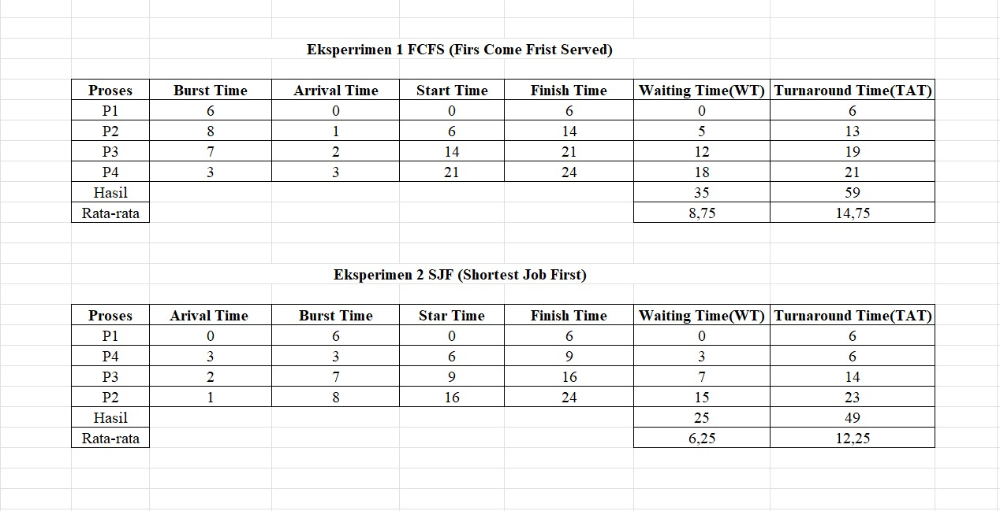
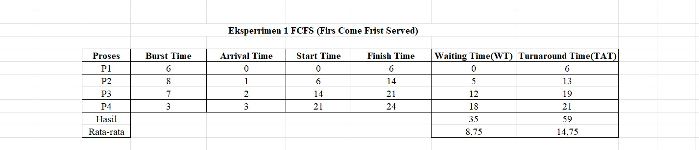
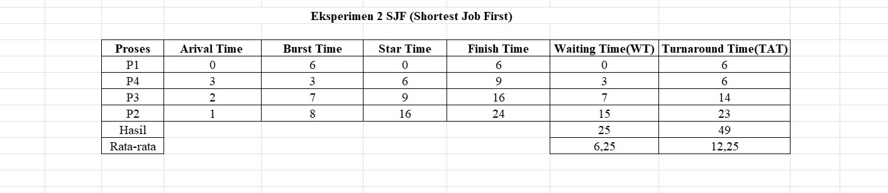

# Laporan Praktikum Minggu [5]
Topik: Penjadwalan CPU – FCFS dan SJF

---

## Identitas
- **Nama**  : Syafi'iyah Rahmadani 
- **NIM**   : 250202968  
- **Kelas** : 1IKRB

---

## Tujuan
Tuliskan tujuan praktikum minggu ini.  
1. Mahasiswa mampu menghitung *waiting time* dan *turnaround time* untuk algoritma FCFS dan SJF.  
2. Mahasiswa mampu menyajikan hasil perhitungan dalam tabel yang rapi dan mudah dibaca.  
3. Mahasiswa mampu membandingkan performa FCFS dan SJF berdasarkan hasil analisis.  
4. Mahasiswa mampu menjelaskan kelebihan dan kekurangan masing-masing algoritma.  
5. Mahasiswa mampu menyimpulkan kapan algoritma FCFS atau SJF lebih sesuai digunakan.  


---

## Dasar Teori
**Penjadwalan CPU (CPU Scheduling)** adalah proses fundamental dalam Sistem Operasi (OS) untuk menentukan proses mana yang akan mendapatkan alokasi CPU berikutnya. Algoritma penjadwalan bertujuan untuk memaksimalkan efisiensi (utilitas CPU) dan meminimalkan waktu respons pengguna melalui minimasi waktu tunggu.

* **Waiting Time (WT):** Total waktu yang dihabiskan proses menunggu di *ready queue*.
* **Turnaround Time (TAT):** Total waktu yang dibutuhkan sejak proses tiba hingga selesai dieksekusi ($TAT = \text{Finish Time} - \text{Arrival Time}$).
* **Burst Time:** Waktu yang dibutuhkan CPU untuk mengeksekusi proses tanpa interupsi.

---

## Langkah Praktikum
1. **Siapkan Data Proses**
   Gunakan tabel proses berikut sebagai contoh (boleh dimodifikasi dengan data baru):
   | Proses | Burst Time | Arrival Time |
   |:--:|:--:|:--:|
   | P1 | 6 | 0 |
   | P2 | 8 | 1 |
   | P3 | 7 | 2 |
   | P4 | 3 | 3 |

2. **Eksperimen 1 – FCFS (First Come First Served)**
   - Urutkan proses berdasarkan *Arrival Time*.  
   - Hitung nilai berikut untuk tiap proses:
     ```
     Waiting Time (WT) = waktu mulai eksekusi - Arrival Time
     Turnaround Time (TAT) = WT + Burst Time
     ```
   - Hitung rata-rata Waiting Time dan Turnaround Time.  
   - Buat Gantt Chart sederhana:  
     ```
     | P1 | P2 | P3 | P4 |
     0    6    14   21   24
     ```

3. **Eksperimen 2 – SJF (Shortest Job First)**
   - Urutkan proses berdasarkan *Burst Time* terpendek (dengan memperhatikan waktu kedatangan).  
   - Lakukan perhitungan WT dan TAT seperti langkah sebelumnya.  
   - Bandingkan hasil FCFS dan SJF pada tabel berikut:

     | Algoritma | Avg Waiting Time | Avg Turnaround Time | Kelebihan | Kekurangan |
     |------------|------------------|----------------------|------------|-------------|
     | FCFS | ... | ... | Sederhana dan mudah diterapkan | Tidak efisien untuk proses panjang |
     | SJF | ... | ... | Optimal untuk job pendek | Menyebabkan *starvation* pada job panjang |

4. **Eksperimen 3 – Visualisasi Spreadsheet (Opsional)**
   - Gunakan Excel/Google Sheets untuk membuat perhitungan otomatis:
     - Kolom: Arrival, Burst, Start, Waiting, Turnaround, Finish.
     - Gunakan formula dasar penjumlahan/subtraksi.
   - Screenshot hasil perhitungan dan simpan di:
     ```
     praktikum/week5-scheduling-fcfs-sjf/screenshots/
     ```

5. **Analisis**
   - Bandingkan hasil rata-rata WT dan TAT antara FCFS & SJF.  
   - Jelaskan kondisi kapan SJF lebih unggul dari FCFS dan sebaliknya.  
   - Tambahkan kesimpulan singkat di akhir laporan.

6. **Commit & Push**
   ```bash
   git add .
   git commit -m "Minggu 5 - CPU Scheduling FCFS & SJF"
   git push origin main
   ```


---

## Kode / Perintah
Tuliskan potongan kode atau perintah utama:
```bash
     Waiting Time (WT) = waktu mulai eksekusi - Arrival Time
     Turnaround Time (TAT) = WT + Burst Time
     
```

---

## Hasil Eksekusi
Sertakan screenshot hasil percobaan atau diagram:


## Eksperimen 1 FCFS ( First Come First Served)


   ##  Eksperimen 2 SJF (Shortest Job First)


## Perbandingan Hasil FCFS & SJF
| Algoritma | Avg Waiting Time | Avg Turnaround Time | Kelebihan | Kekurangan |
|------------|------------------|----------------------|------------|-------------|
| FCFS | 8,75 | 14,75 | Sederhana dan mudah diterapkan | Tidak efisien untuk proses panjang |
| SJF | 6,25 | 12,25 | Optimal untuk job pendek | Menyebabkan *starvation* pada job panjang |

---

## Analisis
Analisa perbandingan kinerja algoritma penjedwalan FCFS dan SJF
1.	Algoritma SJF (Shortest Job First) secara fundamental lebih unggul daripada FCFS dalam konteks efisiensi waktu.
•	SJF Dengan Rata-rata Waktu Tunggu (6,25) dan Rata-rata Waktu Balik (12,25) yang lebih rendah, SJF terbukti optimal karena meminimalkan penundaan dengan memprioritaskan penyelesaian pekerjaan cepat.
•	FCFS menghasilkan waktu tunggu yang lebih lama (AWT 8,75; ATAT 14,75), membuktikan ketidak mampuannya mengatasi proses kecil atau pendek tertahan lama karena harus menunggu antrean dari proses yang sangat panjang.

2.	Kelebihan dan Kekurangan FCFS (First Come First ) unggul dalam kesederhanaan dan keadilan, menjadikannya mudah diimplementasikan karena hanya bergantung pada waktu kedatangan, namun, kelemahan fatalnya adalah ketidak efisienan karena menghasilkan Rata-rata Waktu Tunggu (AWT) yang tinggi akibat efek Convoy. Sebaliknya, SJF (Shortest Job First) memiliki keunggulan utama berupa Kinerja optimalitas matematis, yang secara konsisten meminimalkan AWT dan ATAT. Meskipun superior dalam kinerja waktu, kelemahan signifikan SJF adalah risiko Proses panjang dapat tertunda tanpa batas dan kesulitan praktis dalam implementasinya karena memerlukan prediksi akurat dari Burst Time (waktu eksekusi) proses yang akan datang.

---

## Kesimpulan
Kesimpulannya, Algoritma Shortest Job First (SJF) membuktikan keunggulan kinerjanya, mencapai keoptimalan matematis dengan menghasilkan Rata-rata Waktu Tunggu dan Waktu Balik minimum, namun, efisiensi ini memiliki kelemahan berupa risiko Kelaparan (Starvation) bagi proses panjang dan membutuhkan prediksi waktu eksekusi yang sulit dilakukan. Sebaliknya, FCFS (First Come First Served) dipilih karena kesederhanaan dan keadilannya, tetapi secara signifikan kurang efisien karena menghasilkan waktu tunggu yang tinggi akibat efek Convoy, di mana proses-proses cepat terpaksa menunggu di belakang proses yang sangat lambat.

---

## Quiz
1.  Apa perbedaan utama antara FCFS dan SJF?   
   **Jawaban:**  Perbedaan utama antara FCFS dan SJF terletak pada cara menentukan urutan proses yang akan dijalankan. Pada FCFS (First Come First Served), proses yang datang lebih dulu akan diproses lebih dulu, tanpa melihat berapa lama waktu yang dibutuhkan proses tersebut. Sedangkan pada SJF (Shortest Job First), proses yang memiliki waktu pengerjaan paling singkat yang akan diprioritaskan untuk dikerjakan terlebih dahulu. Sederhananya itu unyuk FCFS merupakan urutan berdasarkan waktu kedatangan. Dan untuk SJF merupakan urutan berdasarkan lama waktu proses.
2. Mengapa SJF dapat menghasilkan rata-rata waktu tunggu minimum?  
   **Jawaban:**  Karena yang singkat dikerjakan dulu, jadi banyak proses kecil cepat selesai dan tidak menumpuk. Waktu tunggu keseluruhan juga menjadi lebih sedikit. Dan apabila proses panjang dikerjakan dulu, proses singkat harus menunggu lebih lama dan waktu tunggu menjadi besar. Jadi SJF mengurangi antrean dengan menyelesaikan tugas yang cepat terlebih dahulu.
3. Apa kelemahan SJF jika diterapkan pada sistem interaktif?  
   **Jawaban:**  Kelemahannya yaitu sulit mengetahui proses mana yang singkat atau lama, karena waktu eksekusi tidak bisa diprediksi. Proses yang panjang bisa terus-terusan ditunda jika selalu ada proses singkat datang. Sistem interaktif butuh respon cepat, sedangkan SJF bisa membuat beberapa proses menunggu lama.

---

## Refleksi Diri
Tuliskan secara singkat:
- Apa bagian yang paling menantang minggu ini?  
Bagian paling menantang minngu ini adalah mencari tau tentang tabel SJF.
- Bagaimana cara Anda mengatasinya?  
cara  mengtasinya saya bertanya ke internet untuk lebih memudahkan saya dalam pemahaman tentang tabel SJF.

---

**Credit:**  
_Template laporan praktikum Sistem Operasi (SO-202501) – Universitas Putra Bangsa_
