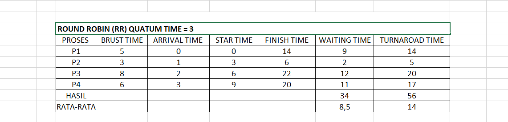
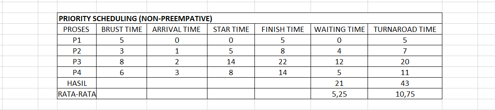

# Laporan Praktikum Minggu [6]
Topik: Penjadwalan CPU – Round Robin (RR) dan Priority Scheduling

---

## Identitas
- **Nama**  : Syafi'iyah Rahmadani  
- **NIM**   : 250202968  
- **Kelas** : 1IKRB

---

## Tujuan
Tuliskan tujuan praktikum minggu ini.  
1. Mahasiswa mampu menghitung waiting time dan turnaround time pada algoritma RR dan Priority.
2. Mahasiswa mampu menyusun tabel hasil perhitungan dengan benar dan sistematis.
3. Mahasiswa mampu membandingkan performa algoritma RR dan Priority.
4. Mahasiswa mampu menjelaskan pengaruh time quantum dan prioritas terhadap keadilan eksekusi proses.
5. Mahasiswa mampu menarik kesimpulan mengenai efisiensi dan keadilan kedua algoritma.

---

## Dasar Teori
Ringkasan Dasar Teori Penjadwalan CPU
Penjadwalan CPU adalah tugas inti sistem operasi untuk memutuskan proses mana yang berjalan, kapan, dan berapa lama, dengan tujuan memaksimalkan penggunaan CPU dan meminimalkan waktu tunggu ($W_t$) serta waktu penyelesaian ($T_t$) proses.

A.	Round Robin (RR) Scheduling:
1.	Prinsip Utamanya untuk dirancang memberikan keadilan (fairness) dalam waktu eksekusi.
2.	Mekanismnya menggunakan time quantum ($q$) yang tetap. Setiap proses mendapatkan jatah waktu eksekusi selama $q$. Jika proses belum selesai, ia akan dihentikan sementara dan dipindahkan ke antrian siap (ready queue) untuk dieksekusi lagi nanti.
3.	Jenisnya Algoritma preemptive.

B.	Priority Scheduling:
1.	Prinsip Utamanya memberikan waktu CPU berdasarkan tingkat kepentingan (prioritas) setiap proses.
2.	Mekanisme untuk setiap proses memiliki angka prioritas yang terkait. Proses dengan prioritas tertinggi biasanya angka terkecil/terbesar, tergantung konvensi akan dieksekusi terlebih dahulu.
3.	Jenisnya bisa preemptive (proses prioritas lebih tinggi yang baru datang dapat menghentikan proses yang sedang berjalan) atau non-preemptive (proses yang sedang berjalan akan selesai sebelum proses prioritas lebih tinggi yang baru datang dieksekusi). Eksperimen Anda menggunakan versi non-preemptive.

C.	Metrik Performa:

1.	Waiting Time (Waktu Tunggu): Total waktu yang dihabiskan proses dalam antrian siap menunggu giliran dieksekusi. Rumus: $\text{Waiting Time} = \text{Start Time} - \text{Arrival Time} + \text{Waktu Tunggu Tambahan (setelah preemption, jika ada)}$.
2.	Turnaround Time (Waktu Balik): Total waktu dari saat proses masuk hingga selesai. Rumus: $\text{Turnaround Time} = \text{Finish Time} - \text{Arrival Time}$.
3.	Tujuan: Meminimalkan rata-rata Waiting Time dan Turnaround Time untuk performa yang optimal.
 

---

## Langkah Praktikum
1. Siapkan Data Proses
2. Melakukan eksperimen 1 – Round Robin (RR)
   - Gunakan *time quantum (q)* = 3.  
   - Hitung *waiting time* dan *turnaround time* untuk tiap proses.  
   - Simulasikan eksekusi menggunakan Gantt Chart (manual atau spreadsheet).  
     ```
     | P1 | P2 | P3 | P4 | P1 | P3 | ...
     0    3    6    9   12   15   18  ...
     ```
   - Catat sisa *burst time* tiap putaran.

3. Melakukan eksperimen 2 – Priority Scheduling (Non-Preemptive)
   - Urutkan proses berdasarkan nilai prioritas (angka kecil = prioritas tinggi).  
   - Lakukan perhitungan manual untuk:
     ```
     WT[i] = waktu mulai eksekusi - Arrival[i]
     TAT[i] = WT[i] + Burst[i]
     ```
   - Buat tabel perbandingan hasil RR dan Priority.

4. Melakukan eksperimen 3 – Analisis Variasi Time Quantum (Opsional)
   - Ubah *quantum* menjadi 2 dan 5.  
   - Amati perubahan nilai rata-rata *waiting time* dan *turnaround time*.  
   - Buat tabel perbandingan efek *quantum*.

5. Melakukan eksperimen 4 – Dokumentasi
   - Simpan semua hasil tabel dan screenshot ke:
     ```
     praktikum/week6-scheduling-rr-priority/screenshots/
     ```
   - Buat tabel perbandingan

6. lalu Commit & Push
   ```bash
   git add .
   git commit -m "Minggu 6 - CPU Scheduling RR & Priority"
   git push origin main
   ```


---

## Kode / Perintah
Tuliskan potongan kode atau perintah utama:
```bash
WT[i] = waktu mulai eksekusi - Arrival[i]
TAT[i] = WT[i] + Burst[i]
```

---

## Hasil Eksekusi
Sertakan screenshot hasil percobaan:

## Hasil Eksperimen 1 – Round Robin (RR)



Dengan demikian `Gantt Chart` akan dihasilkan seperti ini
   ```
 | P1 | P2 | P3 | P4 | P1 | P3 | P4 | P3 |
   0    3    6    9   12   14   17   20   
   ```

## Hasil Eksperimen 2 – Priority Scheduling (Non-Preemptive)



Dengan damikian `Gantt Chart` akan dihasilkan seperti ini
 ```
| P1 | P2 | P3 | P4 |
 0    5    8    14   
 ```
 ## Hasil Eksperimen 3 – Analisis Variasi Time Quantum


Dengan damikian `Gantt Chart` akan dihasilkan seperti ini
 ```
| P1 | P2 | P3 | P4 | P1 | P2 | P4 | P1 | P3 | P4 | P3|
  0    2    4    6   8   10  11   13   14    16    18     
 ```


Dengan damikian `Gantt Chart` akan dihasilkan seperti ini
 ```
| P1 | P2 | P3 | P4 | P3 | P4 |
 0    5    8    13    18    21
 ```
 
## Eksperimen 4 – Dokumentasi

| Algoritma | Avg Waiting Time | Avg Turnaround Time | Kelebihan | Kekurangan |
|------------|------------------|----------------------|------------|-------------|
| RR | 6,75 | 12,25 | Adil terhadap semua proses | Tidak efisien jika quantum tidak tepat |
| Priority | 5,25 | 10,75 | Efisien untuk proses penting | Potensi *starvation* pada prioritas rendah |

---

## Analisis

Membandingkan empat cara berbeda untuk mengatur empat pekerjaan (Proses P1-P4) agar selesai secepat mungkin. Tujuannya adalah mencari cara dengan Waktu Tunggu Rata-rata (AWT) dan Waktu Penyelesaian Rata-rata (ATAT) yang paling kecil

| Algoritma | Rata-Rata Waiting Time | Rata-Rata Turnaround Time |Kesimpulan Sederhana |
   | --- | :--- | :--- | :--- |
   | Priority| 5,25 | 10,75 | Proses penting didahulukan, jadi semua selesai paling cepat. |
   | RR Quantum 2 | 6,75 | 12,25 | Terbaik di antara RR. Giliran sebentar-sebentar (2 detik ). |
   | RR Quantum 5 | 7 |12,5 | Sedang. Gilirannya agak lama (5 detik), jadi proses pendek harus tunggu lebih lama. |
   | RR Quantum 3 | 8,5 | 14| Giliran ini tidak pas, malah bikin total waktu tunggu jadi paling lama. |

Dari data simulasi, terlihat bahwa:

1.	Perbandingan Dua Metode Utama (RR dan Priority)

   a.	Pemenang: Priority Scheduling (5,25 / 10,75)

   • Cara kerjanya seperti layanan VIP/Jalur Cepat. Pekerjaan yang dianggap paling penting atau mendesak diselesaikan duluan tanpa gangguan.
   
   •	Hasilnya: Waktu menunggu dan waktu selesai paling minimal.
   
   •	Kelemahan: Kalau ada pekerjaan tidak penting (low priority), dia bisa menunggu selamanya (teori starvation).

   b.	Round Robin (RR) (Terbaik di Quantum 2: 6,75 / 12,25)

   •	Cara kerjanya seperti Antrian Umum dengan Batas Waktu. Semua orang dapat giliran, tapi hanya boleh bekerja selama waktu tertentu (quantum). Kalau belum selesai, kembali ke belakang antrian.
      
   •	Tujuannya adalah keadilan, semua orang dapat jatah sedikit-sedikit.

2.	Pengertian Quantum dan Round Robin

   a.	Quantum = 2 (Terbaik): Giliran yang sangat sebentar. Ini bagus karena proses-proses kecil (seperti P2) bisa cepat selesai, dan proses besar (P3, P4) tidak mendominasi, sehingga waktu tunggu total jadi lebih rendah.

   b.	Quantum = 5 (Agak Lambat): Giliran yang terlalu panjang. Ini membuat RR jadi mirip "siapa datang duluan" (FCFS), dan proses-proses yang tiba belakangan harus menunggu lama.

   c.	Quantum = 3 (Terburuk): Angka ini tidak menghasilkan timing yang pas dengan kebutuhan pekerjaan, malah membuat penundaan (AWT dan ATAT) paling tinggi.

---

## Kesimpulan
Membandingkan cara mengatur pekerjaan (proses) di komputer. Tujuannya adalah mencari cara yang membuat pekerjaan menunggu paling sebentar dan selesai paling cepat.

1.	Priority Scheduling

   a.	Intinya proses penting didahulukan sampai selesai.
   b.	Lalu hasil waktu tunggu dan waktu selesai (AWT 5,25 / ATAT 10,75) adalah yang terbaik. Sistem ini paling efisien.

2.	Round Robin (RR)

Cara kerja di mana semua proses dapat giliran yang adil, tetapi waktunya harus pas.

   a.	RR Giliran 2 Detik (Quantum = 2)
      o	Hasilnya: Terbaik di antara RR (AWT 6,75 / ATAT 12,25). Giliran yang sebentar ternyata paling seimbang dan efektif untuk jenis pekerjaan ini.

   b.	RR Giliran 3 Detik (Quantum = 3)
      o	Hasilnya: Paling buruk di antara RR (AWT 8,5 / ATAT 14,0). Giliran ini tidak pas, malah membuat total penundaan jadi yang tertinggi.

   c.	RR Giliran 5 Detik (Quantum = 5)
      o	Hasilnya: Tengah-tengah (AWT 7,0 / ATAT 12,5).

3.	Prioritas Cepat, Jika komputer tahu mana yang lebih penting (prioritas), dia bisa menyelesaikan semuanya paling cepat. RR Harus Pas Dalam sistem giliran (RR), memilih durasi giliran (Quantum Time) sangat krusial. Angka yang salah (seperti 3) bisa memperlambat segalanya, sementara angka yang optimal (seperti 2) membuatnya lebih cepat.


---

## Quiz
1. Apa perbedaan utama antara Round Robin dan Priority Scheduling? 
   **Jawaban:**  Perbedaan Round Robin  dan Penjadwalan Prioritas.
Round Robin (RR) adalah  algoritma preemptif yang memastikan keadilan dengan mengalokasikan waktu CPU menggunakan kuantum waktu. Fokus pada waktu respons yang cepat. Dan Penjadwalan Prioritas adalah Algoritma yang memilih proses dengan prioritas tertinggi. Fokus padaKepentingan proses. Kelemahannya yaitu potensi ketidakadilan atau kekurangan sumber daya untuk proses berprioritas rendah.

2. Apa pengaruh besar/kecilnya time quantum terhadap performa sistem? 
   **Jawaban:**  Pengaruh Kuantum Waktu terhadap Performa Sistem
Q kecil, waktu respons cepat, tetapi overhead peralihan konteks sangat tinggi, sehingga menghasilkan throughput rendah.
Q besar, Throughput tinggi, tetapi waktu respons lambat (fungsi seperti FCFS).

3. Mengapa algoritma Priority dapat menyebabkan starvation?  
   **Jawaban:** Karena starvation ( kelaparan) adalah kondisi di mana suatu proses tidak pernah menerima alokasi CPU untuk dieksekusi, meskipun sudah berada dalam antrean siap. Dalam Penjadwalan Prioritas, starvation terjadi ketika sistem terus menerus menerima proses berprioritas tinggi yang baru. Proses berprioritas rendah yang sudah menunggu dalam antrean selalu didahului oleh proses berprioritas tinggi yang baru. Akibatnya, proses berprioritas rendah ini tidak pernah mencapai bagian depan antrean untuk dieksekusi, sehingga memboroskan sumber daya CPU mereka. 

---

## Refleksi Diri
Tuliskan secara singkat:
- Apa bagian yang paling menantang minggu ini?  Bagian paling menantang adalah mencoba eksperimen tentang Quantum.
- Bagaimana cara Anda mengatasinya?  Cara mengatasinya saya mencari tau di internet

---

**Credit:**  
_Template laporan praktikum Sistem Operasi (SO-202501) – Universitas Putra Bangsa_
