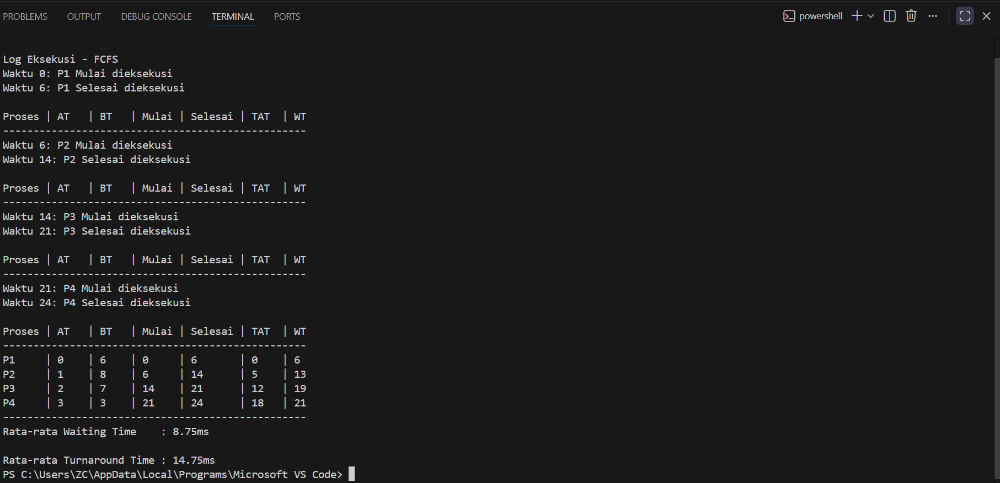

# Laporan Praktikum Minggu [9]
Topik: Simulasi Algoritma Penjadwalan CPU

---

## Identitas
- **Nama**  : Syafi'iyah Rahmadani  
- **NIM**   : 250202968 
- **Kelas** : 1 IKRB

---

## Tujuan
Tujuan praktikum minggu ini.  
1. Mahasiswa mampu mengimplementasikan algoritma penjedwalan Frist-Come, First-Served (FCFS) ke dalam bahasa pemrograman Python untuk mensimulasi menejemen proses pada sistem oprasi.
2. Mahasiswa mampu mengelola dataset eksternal(CSV) sebagai input simulasi dan melakukan ekstrasi data Arrival Time serta Burst secara otomatis.
3. Mahasiswa akan mampu menganalisis kinerja algoritma penjadwalan dengan menghitung metrik kunci seperti Waktu Tunggu (WT), Waktu Penyelesaian (TAT), dan nilai rata-ratanya.
4. Mahasiswa akan mampu menyajikan visualisasi data dalam bentuk tabel dan log eksekusi sistematis untuk merepresentasikan urutan kerja CPU.
5. Mahasiswa akan mampu mempraktikkan manajemen proyek perangkat lunak dengan mengatur kode sumber ke dalam repositori Git dengan rapi dan profesional.


---

## Dasar Teori
1. Penjadwalan Proses yang mekanisme sistem operasi untuk mengelola antrian proses guna memaksimalkan dan meningkatkan efisiensi penggunaan CPU.
2. Algoritma First-Come, First-Served (FCFS) Proses yang tiba lebih dulu akan dilayani terlebih dahulu. Non-preemptif artinya proses yang sedang berjalan tidak dapat dihentikan hingga periode tugasnya (Burst Time) selesai.
3. Parameter Pengukuran.
- Waktu Kedatangan (AT): Waktu kedatangan proses.
- Waktu Burst (BT): Durasi eksekusi yang dibutuhkan untuk proses tersebut.
- Waktu Tunggu (WT): Waktu tunggu untuk proses dalam antrian.

         Rumus: WT = Waktu Mulai - AT

- Waktu Penyelesaian (TAT): Total waktu dari kedatangan hingga penyelesaian.

         Rumus: TAT = Waktu Selesai - AT
4. FCFS mudah diimplementasikan tetapi membawa risiko konfirmitasi, suatu kondisi di mana proses yang singkat terhambat oleh proses yang panjang yang tiba lebih dulu, sehingga meningkatkan waktu tunggu rata-rata.

---

## Langkah Praktikum
1. **Menyiapkan Dataset**

   Membuat dataset proses minimal berisi:

   | Proses | Arrival Time | Burst Time |
   |:--:|:--:|:--:|
   | P1 | 0 | 6 |
   | P2 | 1 | 8 |
   | P3 | 2 | 7 |
   | P4 | 3 | 3 |

2. **Implementasi Algoritma**

   Program harus:
   - Menghitung *waiting time* dan *turnaround time*.  
   - Mendukung minimal **1 algoritma (FCFS atau SJF non-preemptive)**.  
   - Menampilkan hasil dalam tabel.

3. **Eksekusi & Validasi**

   - Menjalankan program menggunakan dataset uji.  
   - Memastikan hasil sesuai dengan perhitungan manual minggu sebelumnya.  
   - Menyimpan hasil eksekusi (screenshot).

4. **Analisis**

   - Menjelaskan alur program.  
   - Membandingkan hasil simulasi dengan perhitungan manual.  
   - Menjelaskan kelebihan dan keterbatasan simulasi.

5. **Commit & Push**

   ```bash
   git add .
   git commit -m "Minggu 9 - Simulasi Scheduling CPU"
   git push origin main
   ```

---

## Kode / Perintah
Tuliskan potongan kode atau perintah utama:
```bash
for p in process_list:
    if current_time < p["at"]:
        current_time = p["at"]
    
    start_time = current_time
    finish_time = start_time + p["bt"]
    
    # Perhitungan WT dan TAT
    waiting_time = start_time - p["at"]
    turnaround_time = finish_time - p["at"]
    
    current_time = finish_time
```
### Tabel Hasil Simulasi FCFS

| Proses | AT | BT | Mulai | Selesai | TAT | WT |
| :---:  | :-:| :-:| :---: | :-----: | :-: | :-: |
| **P1** | 0  | 6  | 0     | 6       | 6   | 0   |
| **P2** | 1  | 8  | 6     | 14      | 13  | 5   |
| **P3** | 2  | 7  | 14    | 21      | 19  | 12  |
| **P4** | 3  | 3  | 21    | 24      | 21  | 18  |

**Statistik Akhir:**
* **Rata-rata Turnaround Time:** 14.75 ms
* **Rata-rata Waiting Time:** 8.75 ms
```bash
git add .
git commit -m "Minggu 9 - Simulasi Scheduling CPU"
git push origin main
```
---

## Hasil Eksekusi
Sertakan screenshot hasil percobaan atau diagram:


---

## Analisis
1. Penjelasan Arti Hasil Eksperimen
Berdasarkan simulasi yang dijalankan menggunakan algoritma FCFS (First-Come, First-Served) pada dataset yang diberikan, diperoleh hasil sebagai berikut:
   - Urutan Eksekusi yaitu mengeksekusi program  proses sesuai urutan kedatangannya, yaitu P1 → P2 → P3 → P4.
   - Waktu Tunggu, terdapat variasi yang signifikan dalam waktu tunggu. P1 tidak menunggu sama sekali (0 ms) karena tiba lebih dulu ketika CPU sedang kosong, sedangkan P4 harus menunggu paling lama, 18 ms, sebelum akhirnya dieksekusi pada detik ke-21.
   - Efisiensi Rata-rata mencangkup hasil perhitungan menunjukkan Waktu Tunggu Rata-rata (AWT) sebesar 8,75 ms dan Waktu Penyelesaian Rata-rata (ATAT) sebesar 14,75 ms. Angka-angka ini mewakili durasi rata-rata suatu proses berada dalam sistem dari kedatangan hingga penyelesaian.
2. Hubungan antara Hasil dan Teori

   Hasil simulasi ini sangat relevan dengan teori dasar penjadwalan proses, khususnya karakteristik algoritma FCFS. Non-Preemptif menurut teori, hasil menunjukkan bahwa setiap proses yang telah memulai eksekusi (Mulai) akan berjalan hingga selesai sepenuhnya (Selesai). Misalnya, P2 mulai pada 6 detik dan hanya melepaskan CPU pada 14 detik tanpa gangguan, meskipun P3 dan P4 telah tiba di sistem. Efek Konvoi menghasil eksperimen menunjukkan kelemahan dalam teori FCFS. P4, dengan waktu eksekusi yang sangat singkat (BT = 3), harus menunggu selama 18 ms (WT) karena harus menunggu P2 dan P3, yang memiliki Burst Time yang jauh lebih lama (8 dan 7). Ini menjelaskan mengapa waktu tunggu rata-rata cukup tinggi dan memiliki keadilan Secara teori, FCFS dianggap adil karena tidak ada proses yang dihentikan sementara (Tidak Ada Kelaparan). Program ini mendemonstrasikan hal tersebut dengan mengeksekusi semua proses berdasarkan antrian waktu kedatangannya, terlepas dari beban kerjanya.

---

## Kesimpulan
Berdasarkan hasil praktikum simulasi penjadwalan CPU, dapat disimpulkan bahwa:

1. Keberhasilan Implementasi yaitu program simulasi berbasis Python berhasil mengimplementasikan logika penjadwalan First-Come, First-Served (FCFS) secara akurat. Program tersebut mampu memproses data dari file CSV dan menghasilkan output tabular yang sesuai dengan perhitungan manual. Kinerja

2. Algoritma FCFS sangat efektif dalam hal kemudahan implementasi dan memastikan bahwa setiap proses akan dilayani (terbebas dari kelaparan). Namun, algoritma ini tidak optimal dalam meminimalkan waktu tunggu.

3. Efisiensi Sistem yaitu waktu Tunggu Rata-rata 8,75 ms menunjukkan adanya hambatan efisiensi yang disebabkan oleh proses dengan waktu burst yang lama tiba lebih awal. Hal ini menegaskan teori bahwa FCFS sangat rentan terhadap Efek Konvoi, di mana proses pendek dipaksa untuk menunggu dalam waktu lama, sehingga menurunkan kinerja sistem secara keseluruhan.

4. Validasi Data menghasilkan simulasi yang menunjukkan bahwa perhitungan waktu mulai, waktu selesai, TAT, dan WT konsisten dengan urutan kedatangan proses (P1 \rightarrow P2 \rightarrow P3 \rightarrow P4), yang membuktikan bahwa logika kode telah berjalan sesuai dengan prinsip antrian First-In-First-Out (FIFO).

---

## Quiz
1. Mengapa simulasi diperlukan untuk menguji algoritma scheduling?  
   **Jawaban:** Simulasi diperlukan untuk menguji algoritma penjadwalan karena beberapa alasan:

   a. Keamanan sistem yaitu menguji algoritma langsung pada sistem operasi yang nyata sangat berisiko karena dapat menyebabkan sistem crash atau tidak stabil. Simulasi memungkinkan pengujian di lingkungan yang aman. 

   b. Efisiensi waktu dan biaya, simulasi memungkinkan kita untuk menjalankan ribuan proses dalam hitungan detik tanpa harus menunggu waktu proses yang sebenarnya. 

   c. Prediksi performa yang melalui simulasi, kita bisa memprediksi rata-rata waktu tunggu (Waiting Time) dan Turnaround Time sebelum algoritma benar-benar diterapkan pada kernel sistem operasi.

2. Apa perbedaan hasil simulasi dengan perhitungan manual jika dataset besar?  
   **Jawaban:**  Perbedaan hasil simulasi dengan perhitungan manual, terutama pada dataset yang besar, dapat signifikan dan disebabkan oleh beberapa faktor utama:

   a. Akurasi yaitu sebuah komputer tetap konsisten dan akuran tanpa resiko human error saat menangani data dalam jumlah besar.

   b. Kecepatan yaitu simulasi memproses ribuan data secara instan, jauh lebih cepat dari perhitungan manual yang memakan waktu lama.

   c. Visualisasi memiliki hasil berupa tabel dan statistik dihasilkan secara otomatis, sehingga pelaporan lebih cepat dibandingkan penyusunan manual.

   d. Fleksibilitasseperti perubahan data (Arrival Time ) akan memperbarui seluruh hasil secara otomatis tanpa perlu menghitung ulang dari awal.

3. Algoritma mana yang lebih mudah diimplementasikan? Jelaskan. 
   **Jawaban:**  Algoritma FCFS yang paling mudah diimplementasikan karena menggunakan logika antrean dasar (FIFO), yang di mana proses dilayani secara langsung berdasarkan urutan kedatangan tanpa perlu memisahkan ulang.

---

## Refleksi Diri
Tuliskan secara singkat:
- Apa bagian yang paling menantang minggu ini?  
Menerjemahkan logika perhitungan manual ke dalam kode Python, terutama saat menangani kondisi waktu tunggu CPU dan memastikan format tabel pada terminal tetap rapi.
- Bagaimana cara Anda mengatasinya?  
Melakukan dry run atau simulasi manual untuk memvalidasi rumus, menggunakan logika percabangan if untuk sinkronisasi waktu, serta menerapkan f-string formatting untuk merapikan tampilan output.

---

**Credit:**  
_Template laporan praktikum Sistem Operasi (SO-202501) – Universitas Putra Bangsa_
